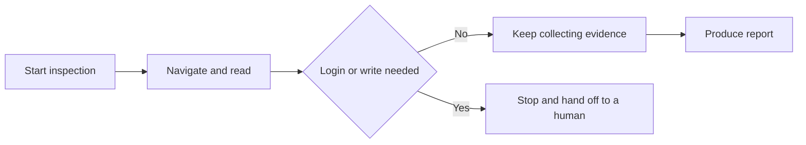

> This language version was automatically translated by AI.

## Use cases and boundaries

Every time a product ships, someone has to click through it again from a new user's perspective: Are the docs understandable? Do the console buttons respond when clicked? Do the API errors match what the docs say? This work is dull and repetitive, and after doing it long enough people habitually skip steps—because you're too familiar, you know where to click next with your eyes closed.

An Agent is never "too familiar." Give it browser capabilities and it will dutifully walk the path you give it and write down what it sees.

Interestingly, this "unfamiliarity" is its greatest value. I used it to inspect our own product, and it checked the real responses against the 401 error format described in the official docs—only to find that the field structure of the response body was nothing like the docs described. A veteran would reflexively skip this kind of problem, because "I know what it actually looks like."

That said, this approach has a few prerequisites; don't force it if they aren't met:

- **The product must have a publicly reachable entry point.** A docs site, a console, a public API—there must be at least something visible. If everything relies on an intranet or requires login before anything is visible, the Agent has nowhere to start.
- **Read-only by default.** The point of inspection is to find problems, not to modify the system under test. This isn't just "advice"—it determines whether you dare to put this thing on a scheduled job to run automatically.
- **Every conclusion must survive the question "how do you know that?"** This is where it most easily goes off the rails; more on that later.

Let's also talk about when not to use it. If the target product requires login and you don't have a legitimate test account, stop here—do not give the Agent a real account and let it "figure out how to get in." The correct response when it hits a login page is to stop and call a human, not to try to work it out on its own.

I ran into exactly this in testing: the entire console namespace was redirected to the login page when not logged in. The Agent stopped right there and honestly wrote "console not executed" in the report. That result doesn't look good, but it is true—far more valuable than fabricating a "the console experience is smooth."

The diagram below is its behavioral boundary, simple enough to state in one sentence: look at whatever it can see, but stop when it needs to act or log in.

### Result preview

Product Experience Officer demo with evaluation tasks, reports, and an execution entry. Source: original showcase material.

## Recommended approach

In one sentence: **give it full capabilities, lock down permissions, and mean what you say.**

Give it full capabilities because you want it to actually click through the web pages, not grab some HTML and fob you off. Lock down permissions because you don't want to be told at midnight that it changed data in the test environment. "Mean what you say" is the one most easily overlooked—every sentence in the report must correspond to a real operation.

| Decision | Recommended way | Reason |
|---|---|---|
| Browser capability | Explicitly enable the browser toolset and include the Beta header it requires | Missing one header means no real web operations and no live preview |
| Write-type built-in tools | Configure a deny policy directly | A read-only inspection doesn't need them; turn them off if you can |
| Your own tokens | Keep them only in the current session's memory and send them once per request | Don't persist them, don't log them, don't put them in environment variables; close the page and they're gone |
| The product's account and password under test | Write them only into the platform's write-only credential interface; the session gets only a reference | Plaintext never enters the prompt, logs, report, or database |
| Hitting a login page | Stop and let a human log in themselves in the browser preview | The browser tool has no "secure password input" protocol; don't let the Agent touch it |
| Multi-user history | Isolate with a random credential; don't derive it from any identity information | Clear its old history and it can no longer see it—simple and effective |

A few points I only learned by tripping over them:

**The browser tool's version number and the Beta header it requires are one package.** Upgrade one and forget the other, and the symptom is a tool that "looks configured but doesn't take effect"—and it won't necessarily error; it just quietly does nothing. Change them together, test them together.

**Distinguish "I really clicked" from "I only read the docs."** This is the credibility foundation of the whole thing. The Agent is fully capable of grabbing a web page and then writing it up as if it had operated it in person. So the rule must be hard: if the browser wasn't really run, the report must say so. In my inspection run the Agent distinguished it clearly on its own—which parts were real browser operations and which were just fetched docs, listed separately.

**The report should prioritize the original artifact delivered by the platform.** If you can't get it and fall back to stitching together the Agent's messages, you'll get some ridiculous things—like the first line of the report being the model's opening line, "OK, here is the complete report." This doesn't affect the content, but it shows the artifact-delivery step didn't go through, and it's worth investigating.

## Validation and maintenance

The most ironic thing about this system is: **it too needs to be inspected.** For something that claims "I'll give you evidence," on what basis do you trust that the evidence it gives is real?

So after each run, confirm at least three things:

**Did the browser really move.** Go through the evidence records and check for real browser calls like navigation, clicks, and screenshots. If it's all web scraping, then every console-related conclusion in the report deserves a question mark—no matter how specific it's written.

**Did read-only actually hold.** A clean read-only inspection should be "zero writes, zero temporary credentials, no cleanup needed." If any of these don't add up, the contract has a leak; forget the report content for now and go check the permission configuration first.

**Is the report complete.** See whether it comes from the delivered artifact or is stitched together from messages. The latter often means something went wrong midway.

For long-term maintenance, what I most want to warn about is a **non-erroring pitfall**: if the evidence tally only takes the latest batch of events and doesn't paginate, then the longer it runs, the more the early tool calls get squeezed out of the tally window by new events.

I watched the whole process against the database, and the tool-call count kept dropping the whole way down—not because it got lazier, but because the evidence was squeezed out. The most insidious thing about this problem is that it's quiet: no errors, no crashes, and you'll just feel that "the numbers look a bit off." For a system that sells "complete evidence" as its selling point, this is far more serious than an outright crash. Keep it as a long-term regression item.

## Optional: Demo source

The Demo is a minimal, directly runnable skeleton: it builds a read-only access summary, opens a session, sends one inspection task, polls for evidence, and finally checks for itself whether the read-only contract held. The core access-contract module is lifted from a real project, not a simplified version rewritten for the demo. How to run it and how to clean up are both in the README.

[View the Demo source](https://github.com/QoderAI/cloud-agents-cookbook/tree/main/demos/product-experience-officer)
