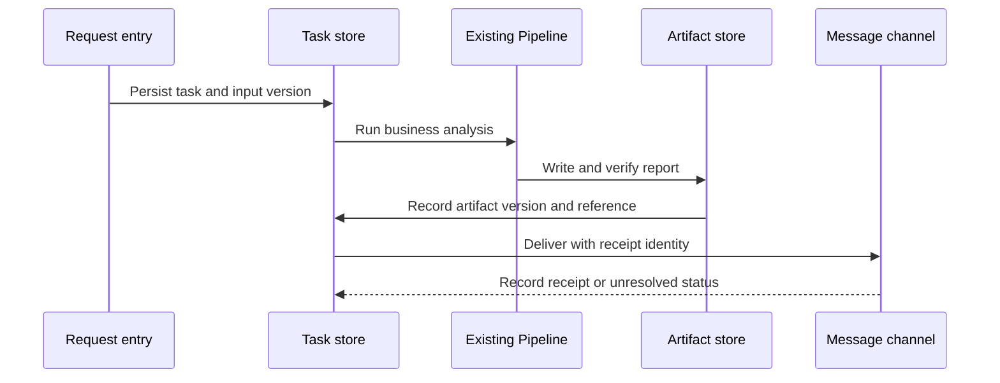
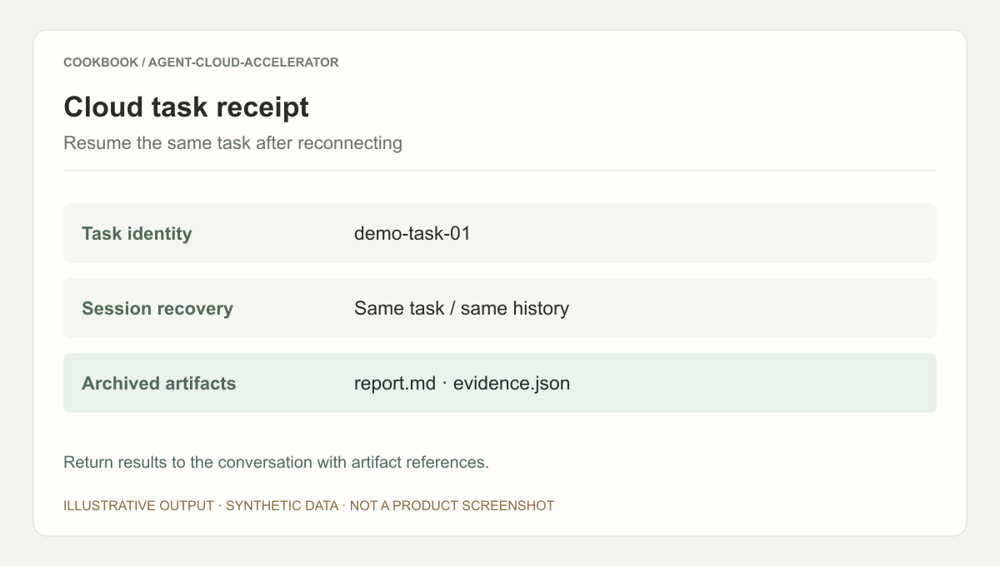

## Scenario and outcome

Moving an Agent into a container preserves its code, but not all the assumptions around that code. Local directories, process memory, terminal progress, and manual file collection become explicit cloud responsibilities.

蒲浦’s Little Pin showcase describes an adapter around multi-Pipeline, multi-Skill Agents: task identity, recovery, archiving, and IM delivery without replacing the core workflow. The available share material does not include an installable package, recovery traces, or measured reliability. The report workflow below is therefore a reference design for that boundary, not a reconstruction of proprietary implementation.

### The failure that exposes the missing layer

A report task reads input, analyzes it, writes a report, then sends a message. If the last request times out, restarting everything duplicates computation. Treating an existing report as success can instead leave the user without a result. Computation and delivery need separate completion records.

## Implementation approach

### Four interfaces around the existing Pipeline

| Interface | Input | Output | Boundary to preserve |
|---|---|---|---|
| Admission | Request, originating conversation, input reference | Stable identity and input version | Repeated text is not necessarily a duplicate request |
| Recovery | Task, checkpoint, artifact record | Next executable step | An existing file may belong to obsolete input |
| Archiving | Local output and generation version | Durable readable reference | A temporary path is not a deliverable |
| Delivery | Destination, artifact, receipt identity | Delivered or unresolved state | A timeout does not establish non-delivery |

Begin by wrapping one existing entry point. Modifying every Skill at the same time makes it difficult to isolate adapter failures from business failures.

### Separate durable computation from notification

The sequence records artifact evidence before attempting notification. A notification failure should return to delivery, not analysis.



Advance a checkpoint after its evidence is durable. Marking a report complete before writing it can leave completion without an artifact. Writing first can leave an artifact without an updated checkpoint; recovery must reconcile its version and integrity.

### A recovery record with meaningful fields

This synthetic application record is not a QCA API payload.

```json
{
  "task_id": "report-demo-001",
  "request_key": "demo-conversation/request-01",
  "input_version": "dataset-v3",
  "pipeline_version": "analysis-v2",
  "compute_state": "completed",
  "artifact": {"version": "dataset-v3/analysis-v2", "state": "verified"},
  "delivery": {"receipt_key": "report-demo-001/result", "state": "unknown"}
}
```

The request key distinguishes redelivery from a new request. Input and Pipeline versions establish whether an artifact is reusable. Unknown delivery is intentional: a timed-out request may already have reached the recipient. Reconcile receipts or use channel-supported idempotency before retrying. Without either capability, duplicate delivery remains possible.

### Choose recovery by failure location

| Failure location | Check first | Resume action |
|---|---|---|
| During analysis | Recoverable business checkpoint | Resume or explicitly recompute |
| During report write | Integrity and version | Rebuild incomplete output |
| After archive, before delivery | Readability and destination | Send the existing result |
| Delivery timeout | Receipt or idempotency identity | Reconcile before retrying |
| Concurrent recovery | Current execution ownership | Permit only the valid owner to commit |

A lease or conditional update can protect result submission. An in-memory flag cannot coordinate separate workers. These are adapter implementation choices, not guarantees established by the showcase.

## Reuse guidance

Interrupt a test task after archiving and before notification. Restart it and compare identity, computation count, artifact version, and destination. Next change the input version and ensure recovery does not reuse the old report.



This is an illustrative receipt. Verification requires the task record, archived file, and delivery evidence together; a completion card alone does not prove recovery.

Measure first-run and recovery duration, repeated work, and duplicate notifications for one Pipeline before adding more Skills. Output equivalence before and after adaptation is the evidence that core behavior was preserved.
