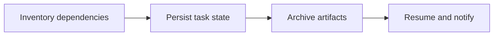

## Scenario and outcome

A successful local run does not establish cloud recovery. This adapter focuses on identity, persistent state, artifacts, and messaging around an existing Agent.

A cloud adaptation layer adds identity, resumption, artifact archiving, and messaging around existing Agent workflows.

This account is based on showcase material contributed by 蒲浦. The diagram and responsibility table organize that material; the worked example below is suggested implementation guidance, not a production measurement.

## Implementation approach

### How the work moves through the product

Inventory local files, environment assumptions, and implicit state. Test restart and recovery protocols rather than validating only the first successful run.



Each transition should carry its input and result forward. This lets the next step use a specific artifact or observation rather than a conversational claim that work is complete.

### Responsibilities and authoritative facts

| Component | Responsibility |
|---|---|
| Existing Agent | Existing business logic |
| Adapter | Identity, checkpoints, recovery |
| Delivery | Artifact archiving and notification |

Cloud adaptation requires more than copying a script. Define recovery boundaries and artifact lifecycles; record non-idempotent effects or require intervention.

### Follow one concrete request

Move a local file-to-report Agent to a cloud worker, resume after interruption, and deliver exactly one correct report.

1. **Inventory dependencies.** List paths, environment assumptions, tool versions, and implicit state.
2. **Persist task state.** Store identity, input digest, phase, and checkpoints outside process memory.
3. **Archive artifacts.** Store addressable artifacts with versions and completion state rather than temporary paths.
4. **Resume and notify.** Reconcile completed steps before resuming, retrying notification independently.

The result needs to preserve the evidence used along the way. When a step lacks data or fails, keep that state visible rather than letting the next step treat it as a successful result.

### A result that can be checked

The following synthetic example makes the expected result concrete. It is an application-level example, not a QCA API request or an observed production record.

```json
{
  "input": {
    "checkpoint": "report-written",
    "artifact_exists": true,
    "notification": "failed"
  },
  "expected": {
    "next_action": "retry-notification",
    "recompute_report": false
  }
}
```

Recovery begins by reconciling facts. A corrupt archive requires artifact recovery rather than simply retrying notification.

## Reuse guidance

Start by reproducing the request above with a known input. Check the resulting state or artifact against the expected output, then add the following failure cases before widening the task scope.

| Failure or ambiguity | Required behavior |
|---|---|
| Crash before archiving | Check artifact presence and integrity during recovery. |
| Two workers claim one task | Use a lease or equivalent to prevent competing writes. |
| Notification failure | Do not repeat successful computation. |