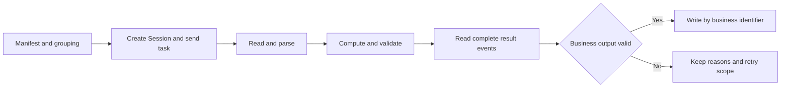
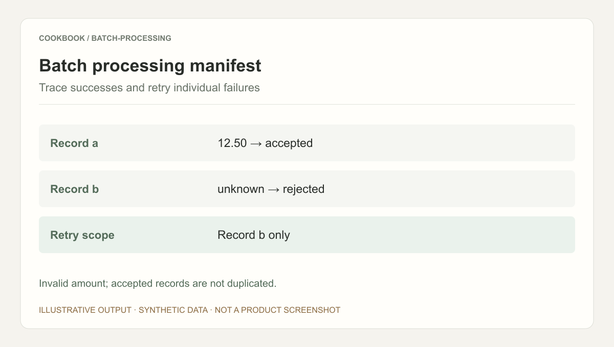

## Scenario and outcome

Batch workloads become difficult when business meaning crosses formats: a complaint changes diagnosis over a conversation, dealers use different quantity units, or an announcement splits facts across a web page and attachments.

This case is based on the four-page original showcase document, QCA Batch Processing Best Practices, dated 2026-09-07. It explains integration patterns and example workloads, not measured production throughput or accuracy.

| Workload | Interpretation challenge | Deliverable |
|---|---|---|
| Support conversations | Initial login complaint later resolves to unpaid account | Final cause, resolution state, evidence |
| Dealer normalization | Cases and pieces require packaging master data | Standard quantities and unresolved records |
| Mixed-format extraction | Budget, deadline, and line items use different sources | Unified record with provenance and gaps |

Stable formats and latency-sensitive arithmetic may be better served by ordinary data pipelines. Agents are useful here for interpreting variation and coordinating multiple processing steps.

## Implementation approach

### The boundary of managed execution

The source assigns multi-turn model and enabled-tool execution to Managed Sessions, and file or script operations to a sandbox. Business scheduling, custom tools, aggregation, and database writeback remain integration responsibilities.

The application needs a business identifier, input version, Session mapping, and writeback state. The Session identifies execution; the business identifier identifies the record to update.

### Submission is only the start

Each input group needs independent business validation before writeback.

Creating a Session does not send the task. Read all relevant result events, and do not treat idle as proof of business success. Validate required fields, the input version, counts, and unresolved records.

### Work through a dealer conversion

This synthetic exercise expands the source’s unit-conversion example.

| Dealer input | Master data | Standard result |
|---|---|---|
| SKU-A, 3 cases | 12 pieces per case | 36 pieces |
| SKU-A, 8 pieces | Piece is the standard unit | 8 pieces |
| SKU-B, 2 cases | Packaging missing | Unresolved |

The Agent can propose field correspondence, but arithmetic should execute deterministically. Packaging needs an effective version: applying today’s package size to an old order can produce numerically valid but incorrect business data.

The deliverable contains both the 44-piece known total and the unresolved SKU-B record. Decide in advance whether the consumer accepts partial completion. If it requires completeness, unresolved data blocks the group rather than disappearing from the report.

### Keep writeback independent

A valid result can still encounter a database timeout. That does not require reparsing the input. A business identifier plus input version can support application-level idempotency for retrying the same result.

| Application state | Meaning | Next action |
|---|---|---|
| Pending submission | Input exists without execution | Submit and persist the mapping |
| Processing | Task sent, result unvalidated | Continue reading progress |
| Needs clarification | Missing business definition | Resolve affected inputs |
| Pending writeback | Valid result, storage unresolved | Reconcile or retry writeback |
| Completed | Result and storage confirmed | Retain provenance |

These are reference application states, not QCA API enums. They separate execution, acceptance, and storage.

### Compare versions on the same inputs

The source notes that Agent updates do not automatically change existing Sessions. Create separate runs for old and new versions on fixed representative inputs. Compare correctness, exception detection, output compatibility, and cost before changing subsequent batches.

Include missing packaging, conflicting fields, and mixed formats rather than validating only the easiest record. A format change may require a Skill update; missing product facts usually require master-data correction.

## Reuse guidance

Start with one dealer and establish a traceable chain from input identifier through execution, validation, and writeback. Add a second format only after recovery works. The source distinguishes text uploads from PDF and image retrieval, which require configured authorized readers and parsers.

The image illustrates an output manifest. Test independent retries, writeback failure, and version retention as well as the successful path.

Compare costs on identical inputs and acceptance criteria, including retries and human review. The source mentions night-time commercial offers, but no unverified discount or savings percentage is reproduced here.
