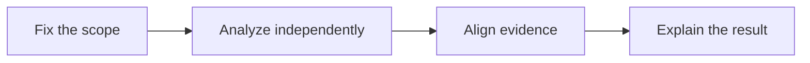

## Scenario and outcome

An anomalous charging order can involve equipment events, order state, and tariff rules. A single-system view can mistake missing evidence for a root cause.

Specialized analyses of orders, equipment, billing, and trends contribute to a charging anomaly diagnosis.

This account is based on showcase material contributed by 霄羽. The diagram and responsibility table organize that material; the worked example below is suggested implementation guidance, not a production measurement.

## Implementation approach

### How the work moves through the product

Use consistent time windows and identifiers. Attach evidence to each finding and separate observations from hypotheses. The original live address changed content, so this entry is documentation only.



Each transition should carry its input and result forward. This lets the next step use a specific artifact or observation rather than a conversational claim that work is complete.

### Responsibilities and authoritative facts

| Component | Responsibility |
|---|---|
| Coordinator | Scope the incident and synthesize findings |
| Specialists | Order, device, billing, trend checks |
| Data tools | Return records and timelines |

Order, device, and billing systems may disagree on time. Align identifiers and timezone semantics before analyzing in parallel.

### Follow one concrete request

Investigate an unexpectedly high synthetic charging bill by checking equipment events, duration, tariff versions, and order state.

1. **Fix the scope.** Pin the order, station, time range, and question.
2. **Analyze independently.** Inspect order state, device events, tariff calculations, and comparable-period context.
3. **Align evidence.** Merge results on a common timeline and identify tariff transitions or missing events.
4. **Explain the result.** Return a recalculation and unresolved checks without implicitly changing bills or issuing refunds.

The result needs to preserve the evidence used along the way. When a step lacks data or fails, keep that state visible rather than letting the next step treat it as a successful result.

### A result that can be checked

The following synthetic example makes the expected result concrete. It is an application-level example, not a QCA API request or an observed production record.

```json
{
  "input": {
    "segments": [
      {
        "hours": 1,
        "rate": 2
      },
      {
        "hours": 0.5,
        "rate": 4
      }
    ],
    "billed": 5
  },
  "expected": {
    "calculated": 4,
    "difference": 1,
    "cause": "requires investigation"
  }
}
```

Recalculation establishes a discrepancy, not its root cause. Check other fee components before attributing the difference to equipment or billing defects.

## Reuse guidance

Start by reproducing the request above with a known input. Check the resulting state or artifact against the expected output, then add the following failure cases before widening the task scope.

| Failure or ambiguity | Required behavior |
|---|---|
| Tariff changes mid-session | Calculate segments with their respective versions. |
| Missing device events | Report the gap without inventing a failure. |
| Aggregate and individual evidence disagree | Explain the specific order and sampling limits. |