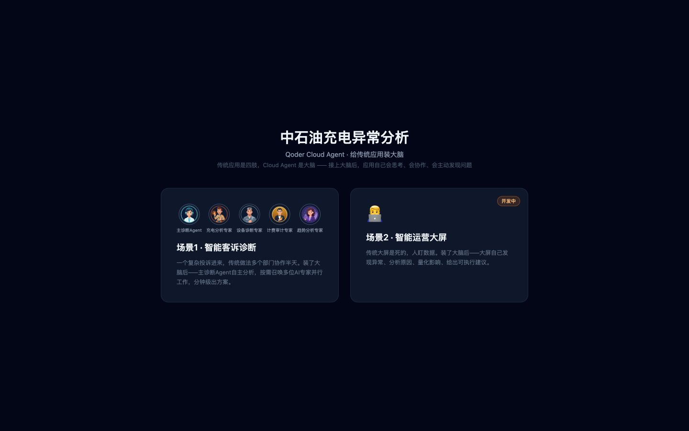

## Scenario and outcome

A disputed charging bill may involve order timing, equipment state, time-based rates, service fees, and discounts. Sequential handoffs between teams make it easy to repeat work or lose evidence.

霄羽’s showcase uses a coordinating diagnostic Agent with order, equipment, billing, and trend specialists. The available material establishes that design and a historical demo, not production accuracy or measured resolution time. The investigation below is a synthetic worked example.

Original showcase screenshot. It is historical material, not a live order or evidence of the service currently hosted at the old address.

## Implementation approach

### Agree on one investigation scope

Before parallel work, identify the same order, device, and time window. An order-level bill, an all-day device alert, and a weekly trend cannot be merged without reconciling scope.

Record the complaint, identifiers, expected versus actual behavior, and available material. A high charge is not automatically an incorrect charge.

### Parallel evidence needs a shared contract

The specialist roles come from the source; these output boundaries are a reference design.

| Specialist | Evidence | Output | Insufficient to establish |
|---|---|---|---|
| Order | Times, state, amounts, discounts | Transaction facts | Device failure |
| Equipment | Relevant logs and interruptions | Observed anomalies | Full financial impact |
| Billing | Rates, fees, rounding | Recalculation and difference | Missing fee values |
| Trends | Comparable devices and periods | Baseline deviations | Causality |

Attach provenance, window, and missing fields to every result. Majority agreement is not independent corroboration when all specialists rely on the same mistaken input.

### Reconcile before attributing

A synthetic order has one hour at rate 2 and half an hour at rate 4. Its bill is 5. These are exercise units, not an operating tariff.

| Component | Calculation | Value |
|---|---|---|
| First interval | 1 × 2 | 2 |
| Second interval | 0.5 × 4 | 2 |
| Known subtotal | 2 + 2 | 4 |
| Difference | 5 − 4 | 1 |

This establishes a difference between known components and the bill, not an overcharge. Request missing service-fee details. A fee of 1 could explain the difference only after confirming that it applies to this order.

### Deliver an actionable unresolved report

A useful report states the verified subtotal, bill, missing fee breakdown, available device evidence, and next query. Missing logs must not become “device healthy.” It can help the next operator without claiming a root cause: arithmetic is complete and the unresolved evidence is explicit.

If timestamps disagree, reconcile timezones. If totals disagree, inspect fee components and effective versions. A broader trend may prioritize investigation but cannot replace order evidence. Preserve observations, inferences, and unresolved questions as distinct parts of the report.

## Reuse guidance

Start with one test order whose answer is known. Remove service fees, device logs, or rate versions one at a time and verify that conclusions become appropriately limited. Check calculation agreement, shared scope, provenance, and whether the next operator can act on the report.

Measure evidence retrieval separately from model work. Additional specialists cannot remove an external data bottleneck. Treat source efficiency claims as targets to validate rather than measured results of this example.
