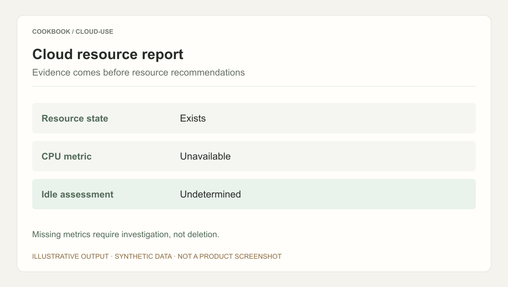
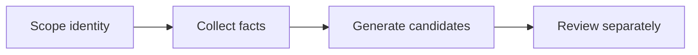

## Scenario and outcome

Cloud work maps intent to specific resources and tool calls. Cloud Use brings identity, permissions, and tool observations into that process.

[Open the documentation](https://docs.qoder.com/zh/cloud-agents/best-practices/cloud-use)

Governed machine identities and tool interfaces support Agent-driven cloud resource inspection and operations.

This account is based on showcase material contributed by QCA Cloud Use 团队. The diagram and responsibility table organize that material; the worked example below is suggested implementation guidance, not a production measurement.

### Result preview



Illustrative output based on this article’s example; synthetic data, not a product screenshot. Missing metrics require investigation, not deletion.

## Implementation approach

### How the work moves through the product

Begin with read-only inventory and a bounded resource scope. Require explicit action targets and authorization for writes, and retain tool results for review.



Each transition should carry its input and result forward. This lets the next step use a specific artifact or observation rather than a conversational claim that work is complete.

### Responsibilities and authoritative facts

| Component | Responsibility |
|---|---|
| Identity | Resource and action scope |
| Agent | Interpret goals and organize calls |
| Cloud tools | Resource observations and results |

Separate observation, recommendation, and mutation. Resource identifiers, permissions, and tool results define execution boundaries.

### Follow one concrete request

Inventory potentially idle resources in a test group, returning evidence without changing or deleting anything.

1. **Scope identity.** Limit tool access to the intended resource group and read-only permissions.
2. **Collect facts.** Query state and utilization over a defined interval rather than inferring from names.
3. **Generate candidates.** Combine usage, dependencies, and missing metrics into a review list.
4. **Review separately.** Require a separate authorized task for changes rather than treating the report as permission.

The result needs to preserve the evidence used along the way. When a step lacks data or fails, keep that state visible rather than letting the next step treat it as a successful result.

### A result that can be checked

The following synthetic example makes the expected result concrete. It is an application-level example, not a QCA API request or an observed production record.

```json
{
  "input": {
    "cpu_metric": null,
    "resource_exists": true
  },
  "expected": {
    "idle": "undetermined",
    "delete_recommended": false
  }
}
```

Missing metrics are not zero. Dependency and business context are also required; this fixture checks restraint when evidence is insufficient.

## Reuse guidance

Start by reproducing the request above with a known input. Check the resulting state or artifact against the expected output, then add the following failure cases before widening the task scope.

| Failure or ambiguity | Required behavior |
|---|---|
| Missing metrics | Report insufficient evidence rather than zero usage. |
| Dependent resource | Expose the dependency before recommending action. |
| Insufficient tool permissions | Report the limitation instead of widening privileges. |