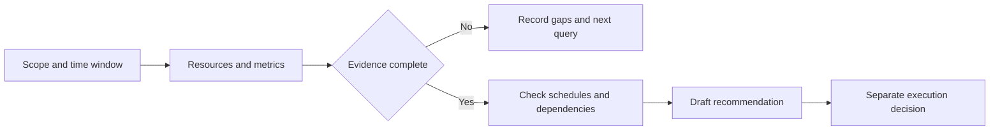

## Scenario and outcome

A resource query is only the beginning of cloud analysis. A costly instance still needs utilization, workload timing, and dependency evidence before a useful recommendation can be made.

The [official Cloud Use guide](https://docs.qoder.com/zh/cloud-agents/best-practices/cloud-use) describes OpenAPI MCP, OAuth credentials, and Skills. This article develops an independent reference workflow for a reviewable resource report; its fixtures are not observed account data.

## Implementation approach

### Define a question the report can answer

“Save money” omits scope and time. Start by inspecting a test project over an agreed window, separating adequately observed resources from evidence gaps, and drafting recommendations.

Keep data access, analytical sufficiency, and execution suitability separate. A successful tool call establishes only the first.

### Connect, then verify one read-only request

Follow the official guide for account-side authorization, MCP OAuth credential configuration, and Agent/session association. Verify one scoped read-only query before expanding the workflow. Credentials should never be included in prompts or report content.

### Turn evidence into a decision

Missing evidence takes a follow-up branch instead of becoming low utilization.

| Synthetic resource | Evidence | Unresolved question | Useful report entry |
|---|---|---|---|
| demo-a | Low utilization in the window | Periodic workload? | Candidate requiring workload review |
| demo-b | Resource exists, metrics unavailable | Actual load? | Evidence gap |
| demo-c | Variable load, scheduled jobs | Peak capacity needs? | Analyze the relevant window |

None establishes a savings amount. Pricing, discounts, configuration, and a proposed change are needed. Multiplying low utilization by a bill does not calculate achievable savings.

### Diagnose the layer that failed

An empty-looking result can mean an authorization failure, wrong scope, absent metrics, or parser failure. These require different recovery actions.

| Observation | Investigate | Do not conclude |
|---|---|---|
| Authorization error | Credential and tool access | No resources exist |
| Resource found, metrics absent | Collection and window | Usage is zero |
| Metrics available, purpose unknown | Schedules and dependencies | Safe to stop |
| Recommendation drafted | Execution record | Optimization completed |

Preserve the failure layer so the next request fills a specific gap rather than repeating the entire investigation.

## Reuse guidance

First ask for scoped metrics, missing evidence, and next checks without resource changes. Then provide periodic-workload context for one candidate and request reevaluation. A useful system can revise or withdraw its first recommendation.

The synthetic illustration emphasizes unavailable metrics and unresolved judgment, not any real account’s condition.

Validate identity, scope, provenance, missing-data handling, and independent action results before introducing scheduled or event-driven execution.
