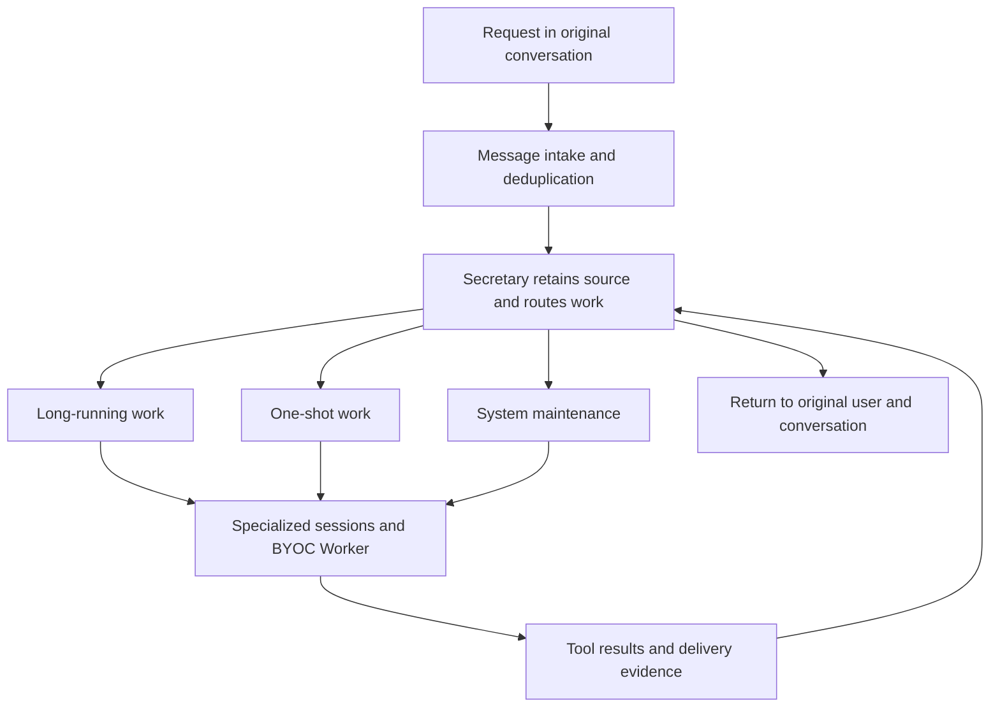

## Scenario and outcome

> **Source material incomplete.** The original delivery record contains internal project and conversation data; source architecture is retained, but a publishable delivery screenshot is missing.

A request such as “resolve this release conflict” can require inspecting code, editing files, waiting for a build, and checking an environment. A chat transcript alone makes it difficult to distinguish actual completion from an unsupported completion message.

Canfeng’s Delivery Bot uses a messaging entry point, QCA routing, specialized sessions, and a BYOC Worker with access to enterprise development tools. Results return to the conversation that started the task.

The supplied case material shows conflict identification, code changes, build and deployment verification, and a returned environment link. This article summarizes that material without internal project identifiers, URLs, or conversation screenshots. The production task was not independently rerun. The record example and acceptance steps below are implementation guidance, not the original system’s public API.

### Define the deliverable

| User question | Required evidence |
|---|---|
| What changed? | Change scope and code diff |
| Was it verified? | Build or test outcome with an execution identifier |
| What is happening now? | Current stage, waiting reason, or failure reason |
| Where can I inspect it? | An authorized artifact or result location |

A narrative summary explains these facts; it does not replace them.

## Implementation approach

### Separate message handling, routing, and execution

The case distinguishes a message adapter called AM, a Secretary role, and specialized Agents. The adapter receives and sends messages. The Secretary retains source context, routes work, and answers progress questions. Specialized Agents own development, review, or diagnosis.



Route by the requested deliverable rather than a keyword. “Look at this change” could mean review it or fix it; the intended output determines the route.

| Lane | Uses described in the material | Design focus |
|---|---|---|
| Long-running work | Features, fixes, and multi-turn delivery | A coordinator retains the goal across analysis, development, and review |
| One-shot work | Reviews, conflicts, diagnostics, builds, and release operations | Bounded scope and explicit completion evidence |
| Maintenance | Rules, roles, Skills, and runtime synchronization | Keep bot maintenance separate from user tasks |

### Carry source context through the task

The original design retains the conversation, sender, request, and deduplication key in Source Context. Background work can then continue independently of the chat window while preserving the return destination.

A minimal record for a custom adapter might look like this. All field names and values are illustrative:

```json
{
  "task_id": "task-demo-001",
  "source": {
    "conversation_id": "demo-conversation",
    "sender_id": "demo-user",
    "message_id": "demo-message-001"
  },
  "goal": "Resolve a test repository conflict and verify the build",
  "route": "one-shot",
  "status": "running",
  "evidence": []
}
```

Generate a stable deduplication key at intake. Progress queries should read task state, and result delivery should use the same source association. This prevents duplicate messages from launching duplicate work and concurrent tasks from returning to the wrong conversation.

### Turn conflict resolution into an acceptance sequence

1. Establish the repository, revisions, allowed changes, and whether release actions are authorized.
2. Inspect the conflict and preserve the version used as the execution baseline.
3. Make changes in a task workspace; request clarification when a conflict requires missing business knowledge.
4. Run verification and track the actual execution identifier. A started build is not a passed build.
5. Collect the diff, verification results, and unresolved issues. Deploy only when included in the authorized scope.
6. Return the outcome to its original source. Failures should identify the stage, cause, and actionable next step.

These steps translate the supplied delivery example into reusable acceptance guidance. Tool outcomes determine stage status; the Agent explains those outcomes.

### Keep execution and notification state separate

The case uses a persistent Mac mini BYOC Worker to reach enterprise Git, build systems, and environments, while QCA manages Agents, sessions, routing, and events.

Worker placement alone does not prove that all data stays inside a network. An implementation must also account for model context, tool output, logs, credential handling, and permitted resource scope.

Persist business execution state independently from message delivery state. If a task succeeds but notification fails, retry the notification rather than repeating code changes or a release operation.

## Reuse guidance

### Start with one bounded task

Implement intake → independent task → test repository build → result delivery first. Once this works reliably, add code edits and specialized roles. This separates failures in messaging, task state, and tool execution before the workflow grows.

| Failure scenario | Expected behavior |
|---|---|
| Duplicate incoming message | Reuse the existing task |
| Progress request during execution | Return a stage supported by tool evidence |
| Failed build | Preserve the execution identifier and report failure |
| Worker restart | Use persisted state to resume, retry, or seek intervention |
| Failed notification | Retry delivery without repeating business operations |
| Concurrent requests from different conversations | Keep execution and return destinations isolated |

The reusable contribution is clear ownership, persistent task state, and evidence-based delivery. Make one task complete and reviewable before expanding the number of routes or the scope of automation.
