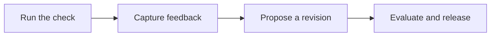

## Scenario and outcome

Design assistance consumes rules while producing corrections, rejections, and expert judgments. This case returns those signals to a reviewed knowledge-update process.

Design interactions produce knowledge proposals that pass evaluation and review before becoming a new knowledge version.

This account is based on showcase material contributed by Qoder Agents 团队. The diagram and responsibility table organize that material; the worked example below is suggested implementation guidance, not a production measurement.

### Result preview


Original showcase concept diagram: design tasks, feedback, knowledge proposals, and expert review; not a runtime screenshot. Source: original showcase material.

## Implementation approach

### How the work moves through the product

Start with one design check. Preserve feedback evidence, separate proposals from published rules, evaluate against reference examples, and retain rollback versions.



Each transition should carry its input and result forward. This lets the next step use a specific artifact or observation rather than a conversational claim that work is complete.

### Responsibilities and authoritative facts

| Component | Responsibility |
|---|---|
| QCA Agent | Assistance and feedback synthesis |
| Expert | Review high-impact changes |
| Knowledge base | Versions, release, rollback |

Acceptance is not the only correctness signal. An accepted suggestion may reflect local preference; revisions need scope, counterexamples, and expert judgment.

### Follow one concrete request

Check a button against a test design rule, capture designer feedback, and produce a knowledge revision proposal.

1. **Run the check.** Identify issues against a pinned rule version and retain component-level evidence.
2. **Capture feedback.** Associate acceptance, modification, or rejection and its reason with the original task.
3. **Propose a revision.** Describe the gap, proposed change, scope, and affected examples without publishing immediately.
4. **Evaluate and release.** Replay reference designs, review differences, roll out narrowly, and retain a rollback version.

The result needs to preserve the evidence used along the way. When a step lacks data or fails, keep that state visible rather than letting the next step treat it as a successful result.

### A result that can be checked

The following synthetic example makes the expected result concrete. It is an application-level example, not a QCA API request or an observed production record.

```json
{
  "input": {
    "feedback": "prefer tighter spacing",
    "scope": "one campaign"
  },
  "expected": {
    "proposal_scope": "one campaign",
    "global_rule_changed": false
  }
}
```

A campaign preference does not justify changing a global rule. Scope the proposal before evaluation and expert review determine broader applicability.

### Try the workflow yourself

The following is a reproduction exercise using test data. It illustrates the application workflow, not a claim about undocumented internals of the original product.

> Check a test button against a pinned spacing rule. Turn feedback into a scoped proposal with supporting examples, counterexamples, and review questions; do not change global policy.

Preserve both the original recommendation and the designer’s revision. A preference for one campaign supports a local rule only. Replay ordinary and campaign pages before the rule owner decides whether to broaden its scope.

### Read the outcome, then try a counterexample

Change only one condition: **Local preference conflicts with policy**. Expected behavior: Keep it local rather than silently changing a global rule. Keep the original run alongside the changed run so you can distinguish a changed decision from a missing output.


## Reuse guidance

Start by reproducing the request above with a known input. Check the resulting state or artifact against the expected output, then add the following failure cases before widening the task scope.

| Failure or ambiguity | Required behavior |
|---|---|
| Local preference conflicts with policy | Keep it local rather than silently changing a global rule. |
| New rule causes regressions | Block release and report failing reference cases. |
| Quality declines after release | Roll back while retaining evaluation evidence. |