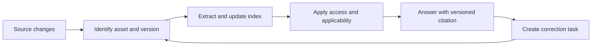
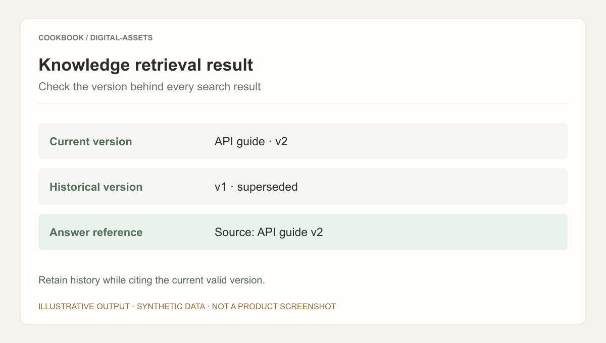

## Scenario and outcome

Team documentation is fragmented across API notes, incident knowledge, reviews, and FAQs. Searchability alone does not establish whether a result is current or applicable.

This case organizes ingestion, retrieval, and feedback as an asset lifecycle. The available showcase does not publish its index implementation or evaluation results. The two-version API exercise below is a reference design for current answers with historical traceability.

## Implementation approach

### Give assets identities beyond filenames

A file can move or change format without becoming a new logical asset. Separate identity, version, provenance, scope, and maintenance ownership.

| Field | Example | Purpose |
|---|---|---|
| Identity | demo-api-guide | Stable references after moves |
| Version/state | v2 current, v1 superseded | Current and historical use |
| Scope | Test project, API B | Applicability |
| Source location | Document and passage | Verifiable citations |
| Maintainer | Documentation owner | Actionable corrections |

### Update the kind of change that occurred

Content changes may require re-extraction. A title change may only need metadata updates. Access revocation must affect retrieval promptly instead of waiting for a full rebuild.

The reference lifecycle connects versioned ingestion to applicable retrieval and reviewable feedback.

### Test competing versions

Let v1 prescribe parameter mode and v2 replace it with strategy. Make the old document richer in matching keywords, then ask about the current API. Similarity alone may prefer the obsolete document.

The answer should cite the relevant v2 passage and state applicability to API B. A question about API A still needs historical evidence; deleting every old document is not a solution.

| Question | Evidence | Response |
|---|---|---|
| Current parameter | v2 | strategy with citation |
| Why an old project uses mode | v1 and version relationship | Explain the historical difference |
| Version unspecified | Version metadata | Clarify or state the assumption |
| Current material inaccessible | Authorized evidence only | Report the limit without disclosure |

### Route feedback to the actual problem

An obsolete citation requires version-selection repair. An incorrect source needs a maintainer change. Misinterpretation of a correct source needs retrieval or answer repair. Adding another paragraph to the library does not address every failure.

Retain the question, selected version, disputed answer, correction, and outcome. Replay the failing question after publication together with a previously correct question to detect regressions.

## Reuse guidance

Begin with one project and document family. Establish current-to-historical relationships before scaling ingestion. Judge the first release by whether an answer resolves to its source, version, and scope, not by asset count.

The synthetic outcome illustrates v2 selection. Test version changes, deletion, revoked access, and feedback replay as well.

An index without provenance becomes harder to explain as it grows. A complete lifecycle for a small collection is a stronger foundation than an unversioned bulk import.
