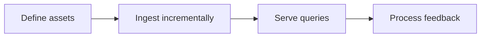

## Scenario and outcome

Finding a document does not guarantee a current, applicable answer. This case connects ingestion, retrieval, and feedback across scattered development knowledge.

Incremental ingestion and usage feedback maintain a shared organizational knowledge foundation.

This account is based on showcase material contributed by 蓝屿. The diagram and responsibility table organize that material; the worked example below is suggested implementation guidance, not a production measurement.

### Result preview


Illustrative output based on this article’s example; synthetic data, not a product screenshot. Retain history while citing the current valid version.

## Implementation approach

### How the work moves through the product

Retain source, version, scope, and access boundaries for each asset. Treat corrections as reviewable updates rather than allowing model answers to overwrite source material.



Each transition should carry its input and result forward. This lets the next step use a specific artifact or observation rather than a conversational claim that work is complete.

### Responsibilities and authoritative facts

| Component | Responsibility |
|---|---|
| Ingestion | Sources, versions, incremental changes |
| Knowledge service | Scoped retrieval and citations |
| Maintenance | Revision proposals and release history |

Retrieval must address both discoverability and applicability. Provenance, version, and scope should accompany each result, not remain hidden in a catalog.

### Follow one concrete request

Index a test project’s API notes, change records, and FAQs, then use a query to surface obsolete information.

1. **Define assets.** Assign stable identifiers, project scope, versions, provenance, and access boundaries.
2. **Ingest incrementally.** Detect changes through content digests and update affected index units.
3. **Serve queries.** Apply access scope before retrieval and cite the matching versions.
4. **Process feedback.** Turn incorrect citations and missing knowledge into reviewed revision proposals.

The result needs to preserve the evidence used along the way. When a step lacks data or fails, keep that state visible rather than letting the next step treat it as a successful result.

### A result that can be checked

The following synthetic example makes the expected result concrete. It is an application-level example, not a QCA API request or an observed production record.

```json
{
  "input": {
    "query": "current API",
    "assets": [
      {
        "id": "a",
        "version": 1,
        "state": "superseded"
      },
      {
        "id": "a",
        "version": 2,
        "state": "current"
      }
    ]
  },
  "expected": {
    "selected_version": 2,
    "citation": "a@2"
  }
}
```

Equal retrieval scores do not justify choosing a random version. Use historical versions only when the question calls for them and label their applicability.

### Try the workflow yourself

The following is a reproduction exercise using test data. It illustrates the application workflow, not a claim about undocumented internals of the original product.

> Answer using the current API documentation and cite its version and location. Follow superseded documents to their replacements; report a gap if no valid source exists.

Keep keyword-rich obsolete documentation alongside its replacement. Check retrieval ordering and that the answer cites v2. Then remove access to the current document: the answer should report unavailable evidence rather than cross access boundaries.

### Read the outcome, then try a counterexample

Change only one condition: **Unauthorized asset**. Expected behavior: Exclude it from retrieval and generated answers. Keep the original run alongside the changed run so you can distinguish a changed decision from a missing output.


## Reuse guidance

Start by reproducing the request above with a known input. Check the resulting state or artifact against the expected output, then add the following failure cases before widening the task scope.

| Failure or ambiguity | Required behavior |
|---|---|
| Unauthorized asset | Exclude it from retrieval and generated answers. |
| Superseded document | Prefer the current version and explain relevant changes. |
| Unverified user feedback | Create a proposal instead of overwriting knowledge. |