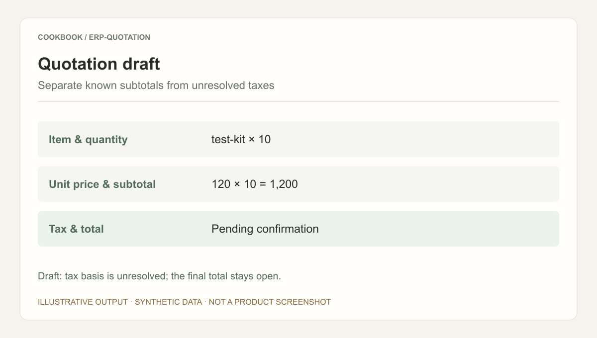
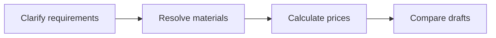

## Scenario and outcome

Nonstandard purchasing requests rarely map directly to one part number. Quotations require reconciling materials, assemblies, alternatives, and price rules.

An ERP proof of concept connects conversational requirements to materials, bills of materials, pricing, and draft quotations.

This account is based on showcase material contributed by 泡鲁达. The diagram and responsibility table organize that material; the worked example below is suggested implementation guidance, not a production measurement.

### Result preview



Illustrative output based on this article’s example; synthetic data, not a product screenshot. Draft: tax basis is unresolved; the final total stays open.

## Implementation approach

### How the work moves through the product

Use test catalogs first. Preserve quantity, units, price validity, and tax assumptions, and separate draft generation from submitting a binding quotation.



Each transition should carry its input and result forward. This lets the next step use a specific artifact or observation rather than a conversational claim that work is complete.

### Responsibilities and authoritative facts

| Component | Responsibility |
|---|---|
| Agent | Clarify needs and assemble options |
| ERP | Materials, assemblies, pricing facts |
| Quote workflow | Calculation, approval, submission |

The model can interpret requirements but must not replace ERP pricing facts. Separate drafting from submission so users can inspect parts, quantities, taxes, and validity.

### Follow one concrete request

Generate standard and enhanced draft quotations for ten equipment spare-parts kits using a test catalog.

1. **Clarify requirements.** Extract use, quantity, delivery date, and constraints; ask about missing specifications.
2. **Resolve materials.** Query candidate part numbers, bills of materials, and substitutes while retaining identifiers.
3. **Calculate prices.** Use ERP prices, currency, validity, and tax treatment; calculate subtotals deterministically.
4. **Compare drafts.** Show differences, unresolved conditions, and price sources without submitting a binding quote.

The result needs to preserve the evidence used along the way. When a step lacks data or fails, keep that state visible rather than letting the next step treat it as a successful result.

### A result that can be checked

The following synthetic example makes the expected result concrete. It is an application-level example, not a QCA API request or an observed production record.

```json
{
  "input": {
    "part": "test-kit",
    "quantity": 10,
    "unit_price": 120,
    "tax_basis": "excluded"
  },
  "expected": {
    "subtotal": 1200,
    "tax": "unresolved",
    "state": "draft"
  }
}
```

The subtotal is known, but taxes remain unresolved. Do not invent a tax rate merely to complete the quotation.

## Reuse guidance

Start by reproducing the request above with a known input. Check the resulting state or artifact against the expected output, then add the following failure cases before widening the task scope.

| Failure or ambiguity | Required behavior |
|---|---|
| Ambiguous material name | Explain alternatives and request a selection. |
| Expired price | Refresh the price or mark it unresolved. |
| Repeated generation request | Reuse the draft identifier rather than duplicate documents. |