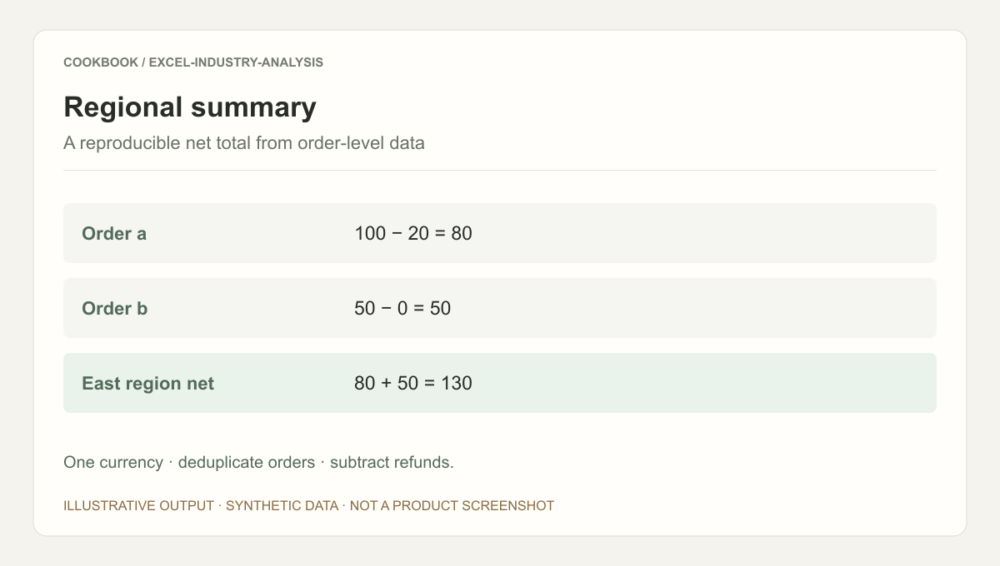

## Scenario and outcome

The same sales question can require new field, unit, and metric interpretations for each workbook. This case connects that confirmation step to natural-language analysis.

A mapper interprets spreadsheet fields while an analyzer produces constrained aggregation configurations for deterministic execution.

This account is based on showcase material contributed by 阿米. The worked example explains integration decisions and is not a production measurement.

### Result preview



Illustrative output based on this article’s example; synthetic data, not a product screenshot. One currency · deduplicate orders · subtract refunds.

## Implementation approach


The two roles separate schema interpretation from question compilation. The Mapper proposes fields and units; the Analyzer builds a permitted calculation plan; deterministic code calculates the result. The worked example below connects those responsibilities to one reproducible report.

### Full walkthrough: from unfamiliar rows to regional net revenue

Suppose the user asks for August net revenue by region. The runnable fixture below contains six rows: a region alias, an exact duplicate, a July order, and an order without a region. This exposes interpretation decisions before a polished report hides them.

### Step 1: ask the Mapper for a proposal

> Identify the order key, business date, region, gross amount, refund, and currency. List definitions, aliases, and exception policies that need confirmation. Do not calculate a final result yet.

Confirm that each row is a complete order rather than a line item. Only then is order-level deduplication valid. Confirm that gross precedes refunds, that East and east mean the same region, and that missing regions must remain unresolved. Save the approved mapping version for subsequent questions; changed units or row granularity require renewed agreement.

### Step 2: compile the question into permitted operations

> Using the approved mapping, calculate August 2026 net revenue by region. Remove exact duplicates, filter business dates, group by canonical region, and sum gross minus refunds. Return a calculation plan and exception policy without executing arbitrary code.

The executor checks supported fields, operations, and dates. This example uses an inclusive August start and exclusive September start, fixes currency to CNY, and excludes unmapped regions with reasons. A repeated identifier with different values is a conflict, not a reason to silently keep the first row.

### Step 3: run deterministic arithmetic

Save and run this Python 3 example using the standard library. CSV text stands in for rows extracted from a workbook. This is an educational calculation example, not original product source; it does not implement Excel upload, model calls, or access controls.

```python
import csv
import io
from decimal import Decimal

source = """order_id,date,region,gross,refund,currency
A,2026-08-01,east,100,20,CNY
B,2026-08-02,East,50,0,CNY
B,2026-08-02,East,50,0,CNY
C,2026-08-03,west,80,10,CNY
D,2026-07-31,east,40,0,CNY
E,2026-08-04,,60,0,CNY
"""
aliases = {"east": "east", "west": "west"}
seen, totals, excluded = {}, {}, []
for row in csv.DictReader(io.StringIO(source)):
    key = row["order_id"]
    if key in seen:
        if seen[key] != row:
            raise ValueError(f"Conflicting duplicate: {key}")
        excluded.append((key, "duplicate"))
        continue
    seen[key] = row
    if not "2026-08-01" <= row["date"] < "2026-09-01":
        excluded.append((key, "outside period"))
        continue
    region = aliases.get(row["region"].strip().lower())
    if region is None:
        excluded.append((key, "unmapped region"))
        continue
    if row["currency"] != "CNY":
        raise ValueError("A currency conversion policy is required")
    gross, refund = Decimal(row["gross"]), Decimal(row["refund"])
    if not gross.is_finite() or not refund.is_finite():
        raise ValueError("Non-finite amount")
    totals[region] = totals.get(region, Decimal(0)) + gross - refund

assert totals == {"east": Decimal(130), "west": Decimal(70)}
assert len(excluded) == 3
print({region: str(value) for region, value in totals.items()})
print(excluded)
```

### Step 4: explain both the totals and the exclusions

The result is east 130 and west 70, totaling 200 CNY. Three of six input rows are excluded: the duplicate B, July order D, and unmapped-region order E. Present exclusions next to the aggregate so that missing data is not mistaken for zero revenue.

> August net revenue for mapped regions is 200 CNY: east 130 and west 70. One exact duplicate, one out-of-period order, and one order without a region were excluded. The unmapped August order contributes another 60 CNY that has not been assigned to a region.

This does not establish that all August revenue is 200. Resolve the missing region and recompute while retaining the previous mapping and exclusion manifest for reconciliation.

### Change three inputs to exercise the boundaries

Change the duplicated B amount to 55: expect a conflict instead of arbitrarily choosing one value. Change C to USD: expect a conversion-policy error instead of a mixed-currency total. Map E to west: expect west 130, total 260, and two exclusions.

The example deliberately assumes ISO dates and known columns. A real workbook reader must also handle multiple sheets, Excel date serials, merged headers, and cell types. Those belong in ingestion and mapping, not hidden inside the report-writing prompt.

## Reuse guidance

Start by reproducing the request above with a known input. Check the resulting state or artifact against the expected output, then add the following failure cases before widening the task scope.

| Failure or ambiguity | Required behavior |
|---|---|
| Tax-inclusive and exclusive amounts | Require an explicit metric definition before combining values. |
| Duplicates and missing regions | Reconcile exclusion counts and totals against a reference sheet. |
| Unsupported metric | Ask for clarification instead of inventing a value. |