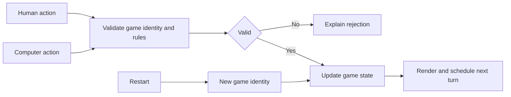

## Scenario and outcome

Game Square groups card and casual games behind one browser entry. The showcase describes playable frontend games, including card-rule validation and computer opponents.

It demonstrates an application outcome, not a verified record of fully autonomous development. This case examines rules, state, and interaction without inferring an unpublished build process from screenshots.

Game selection: card games and casual games share one entry point. Source: original showcase material.

## Implementation approach

### Test state transitions independently of rendering

Render from the state after each accepted action. Separating rules from button handlers allows deterministic action-sequence tests without playing every game manually.

Computer moves and timed actions should pass the same validation boundary. This is reference architecture, not a claim about published modules.

### Separate discovery from the game loop

Entry cards explain games and lead into play. Within a game, users need state, turn, valid actions, and restart controls.

Shared navigation does not require identical rule states across different games.

### Let rules validate actions

Disabled buttons are not rule enforcement. Reject ordinary actions after completion, while restart creates fresh state.

Card games also validate turn, combination, and ownership. Human and computer actions should pass the same rules.

### Test restart with delayed actions

A delayed opponent action or timer from a finished game can corrupt a restarted game. Clearing the screen is insufficient.

Cancel obsolete work or reject actions with an old game identity. Verify scores, turns, and board or cards, not just the heading.

### Evaluate mobile interaction separately

Touch interactions can fail where mouse controls work. Check target clarity, visible state, orientation changes, and continuity.

Explain rejected actions in terms of current rules instead of a generic failure message.

## Reuse guidance

Exercise start, legal and illegal actions, finish, restart, rapid input, and delayed actions. Record rule correctness, recovery, and presentation separately; an entry screenshot covers only part of presentation.
