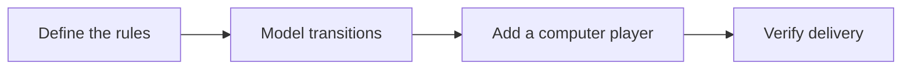

## Scenario and outcome

After opening a browser game, users need playable rules and coherent matches. This collection turns Agent-assisted development into directly usable software.

[Open the online entry](https://hao2-games.vercel.app)

A browser game collection demonstrates playable frontend artifacts delivered with Agent assistance.

This account is based on showcase material contributed by 何傲. The diagram and responsibility table organize that material; the worked example below is suggested implementation guidance, not a production measurement.

### Result preview


Game selection: card games and casual games share one entry point. Source: original showcase material.

## Implementation approach

### How the work moves through the product

Separate game rules, state transitions, and presentation. Test illegal moves, win conditions, and restarting; browser gameplay does not imply live Agent inference on every move.



Each transition should carry its input and result forward. This lets the next step use a specific artifact or observation rather than a conversational claim that work is complete.

### Responsibilities and authoritative facts

| Component | Responsibility |
|---|---|
| Rules | Legal actions and win conditions |
| State | Turns, scores, restart |
| Interface | Input and match presentation |

The artifact is browser software. Agent-assisted development does not imply runtime model inference, and deterministic rule checks remain appropriate.

### Follow one concrete request

Use a reproducible test match to distinguish a loading game from a correct game, checking legal moves, scoring, and restart behavior.

1. **Define the rules.** Pin the game variant, turns, win conditions, and illegal-action behavior.
2. **Model transitions.** Drive presentation from a coherent state machine rather than independent UI mutations.
3. **Add a computer player.** Validate computer actions through the same rules as human actions.
4. **Verify delivery.** Test touch input, end states, and restart using reproducible seeds or action traces.

The result needs to preserve the evidence used along the way. When a step lacks data or fails, keep that state visible rather than letting the next step treat it as a successful result.

### A result that can be checked

The following synthetic example makes the expected result concrete. It is an application-level example, not a QCA API request or an observed production record.

```json
{
  "input": {
    "state": "finished",
    "action": "player-move"
  },
  "expected": {
    "accepted": false,
    "state": "finished"
  }
}
```

A finished game rejects ordinary moves while allowing an explicit restart. Enforce this in rules, not just by hiding buttons.

### Try the workflow yourself

The following is a reproduction exercise using test data. It illustrates the application workflow, not a claim about undocumented internals of the original product.

> Exercise start, legal moves, finish, and restart in the demo. Check whether ordinary moves are accepted after completion and whether restart clears previous state.

Finish a short game, repeat the last action, then restart. Hiding controls is not enough: rules must reject post-finish moves. Restart should create fresh state instead of inheriting scores or queued actions.

### Read the outcome, then try a counterexample

Change only one condition: **Repeated action clicks**. Expected behavior: Accept one valid action per turn. Keep the original run alongside the changed run so you can distinguish a changed decision from a missing output.


## Reuse guidance

Start by reproducing the request above with a known input. Check the resulting state or artifact against the expected output, then add the following failure cases before widening the task scope.

| Failure or ambiguity | Required behavior |
|---|---|
| Repeated action clicks | Accept one valid action per turn. |
| Illegal computer action | Reject it and select a valid fallback. |
| Restart after completion | Reset scores and pending timers. |