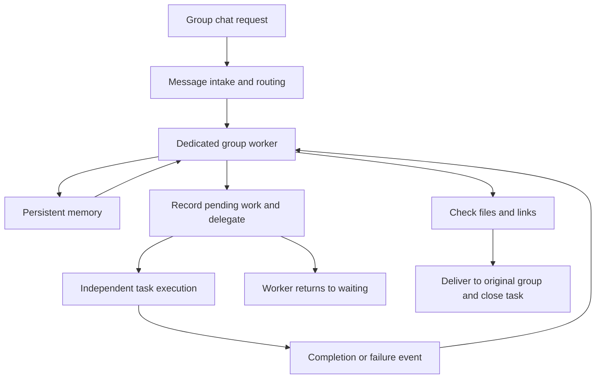

## Scenario and outcome

A group-chat Agent can answer a short question immediately. A request for a working web demo is different: someone must interpret it, delegate execution, wait for results, inspect the artifact, and deliver it to the right group. The message entry point should not remain blocked throughout that task.

He Ao's public [HAO2 V1.1 system report](https://hao2-v1-report.vercel.app) describes an operating group-chat task system. His [multi-Agent lifecycle explanation](https://hao2-agent-managed.vercel.app) identifies HAO2 as an asynchronous implementation built on QCA.

The author reports capabilities including group-chat responses, demo development and deployment, file delivery, and authorized local collaboration. This article focuses on orchestration. We have not accessed its runtime or independently measured production performance, so the reported cost, initialization-time, and deployment-scale figures are not presented as promised benefits.

The useful outcome is a complete delivery loop: requests enter through a familiar group, specialist sessions perform work, and files or checked links return to that collaboration surface. A statement that a task is finished is not itself the deliverable.

## Implementation approach

### Separate message intake from task execution

The public report separates message reception, routing, dedicated group workers, and task sessions. Each group worker carries its group's context and delegates larger work. The receiver has its own supervision mechanism, allowing message intake and long-running execution to have different lifetimes.

This diagram abstracts the public descriptions, omitting unrelated personal capabilities and business configuration:

### Resume from reports rather than waiting continuously

The lifecycle explanation says that HAO2 records delegated work in `pending_jobs`, returns to waiting, and resumes when the executor reports back. The reusable idea is durable pending work, not the particular variable name.

A task remembered only in a conversation can become difficult to recover after restart or context changes. An explicit record gives recovery, timeout handling, and completion a place to operate. Repeatedly asking whether the executor has finished is not a substitute for a completion or failure protocol.

The following state design is a recommendation for an adaptation, not a published database schema from HAO2:

| State | Minimum information | Next step |
|---|---|---|
| Received | Original group, request identifier, objective | Assign execution |
| Delegated | Execution session, delegation time, deadline condition | Wait for a report |
| Awaiting acceptance | Artifact references, outcome, failure reason | Check the objective |
| Delivered or failed | Delivery message identifier or failure explanation | Close and retain the record |

### Give memory, sessions, and tasks separate lifetimes

The report describes persistent memory and group-specific context. The lifecycle explanation distinguishes task closure, idle workers, and retirement of sessions. Finishing a task does not imply erasing a group's knowledge; an idle worker can still have pending delegated work.

Group routing is only one part of isolation. An adaptation must also assign ownership to files, credentials, and delivery destinations. Prompt instructions alone are insufficient. The public material describes an isolation goal; this article does not independently audit the underlying isolation mechanisms.

### Check artifacts before declaring delivery

The public explanation calls for delivering original files alongside links and checking deployed links before sending them. That is more concrete than relying on an executor's success message. However, an HTTP 200 response establishes reachability, not functional correctness.

Pass acceptance conditions with the task. For a registration page, for example, verify that the page opens, required fields behave correctly, submission has an observable result, and failures are explained.

## Reuse guidance

Begin with one group, one task class, and one executor. Complete the delivery loop before adding parallel specialists. The following failure checks often matter more than the number of Agents:

1. Restart the worker after delegation: pending work remains discoverable and reports retain an owner.
2. Deliver the same completion event twice: the user receives one final delivery, not duplicate messages.
3. Fail execution or exceed its deadline: the original group receives an understandable status.
4. Submit similar requests from two groups: artifacts, messages, and credentials stay with the correct owner.
5. Produce a file but an unreachable link: the task remains unaccepted or failed rather than claiming success.

These are proposed acceptance checks, not tests we ran against the author's system. Choose deadlines for your platform, workload, and budget instead of copying fixed timeout values from another deployment.

The pattern fits report generation, development tasks, and file processing. A short question may not benefit from additional specialists. Delegate when work needs independent context, permissions, or a longer execution lifetime.

## Public sources and scope

- [HAO2 V1.1 system report](https://hao2-v1-report.vercel.app), published by the author on August 8, 2026.
- [Managed sub-Agent method and lifecycle](https://hao2-agent-managed.vercel.app), specifically its HAO2 discussion of asynchronous delegation and reports.

This article does not redistribute group conversations, personal files, voice assets, credentials, or customer project details. It does not include the original system's runnable source. The diagram and acceptance guidance are an editorial interpretation of the public descriptions.
