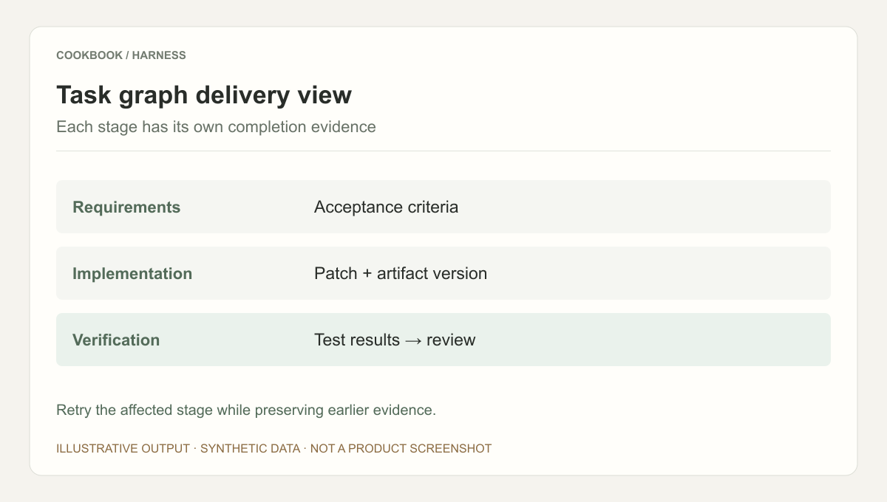
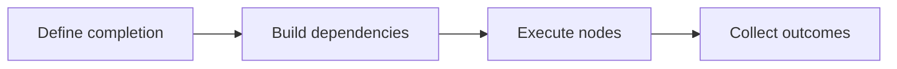

## Scenario and outcome

Development moves through requirements, implementation, and verification, with revisions and failures sending work backward. Harness represents these dependencies as a task graph.

A task graph organizes clarification, planning, implementation, verification, and release.

This account is based on showcase material contributed by 蛋总/与天. The diagram and responsibility table organize that material; the worked example below is suggested implementation guidance, not a production measurement.

### Result preview



Illustrative output based on this article’s example; synthetic data, not a product screenshot. Retry the affected stage while preserving earlier evidence.

## Implementation approach

### How the work moves through the product

Define inputs, outputs, evidence, and completion conditions for each node. Place human decisions at explicit transitions and resume failed nodes without restarting unrelated work.



Each transition should carry its input and result forward. This lets the next step use a specific artifact or observation rather than a conversational claim that work is complete.

### Responsibilities and authoritative facts

| Component | Responsibility |
|---|---|
| Graph | Stages, dependencies, rollback |
| Agent | Perform specialized node work |
| Review | Verify artifacts and decide transitions |

Graphs suit dependencies, rollback, and human gates. Keep simple tasks linear; additional graph complexity requires stronger node contracts.

### Follow one concrete request

Implement input validation in a test repository using resumable requirement, implementation, and verification nodes.

1. **Define completion.** Specify accepted inputs, error behavior, and reference cases.
2. **Build dependencies.** Gate implementation on requirements, verification on artifacts, and release on authorization and passing results.
3. **Execute nodes.** Record input versions, outputs, and tool results; invalidate only affected downstream work.
4. **Collect outcomes.** Expose evidence and unresolved issues, and make human decisions explicit state transitions.

The result needs to preserve the evidence used along the way. When a step lacks data or fails, keep that state visible rather than letting the next step treat it as a successful result.

### A result that can be checked

The following synthetic example makes the expected result concrete. It is an application-level example, not a QCA API request or an observed production record.

```json
{
  "input": {
    "requirements_version": 2,
    "implementation_based_on": 1,
    "tests": "passed"
  },
  "expected": {
    "implementation": "stale",
    "delivery": "blocked"
  }
}
```

Passing tests validate the old requirement version only. Reassess implementation and test relevance after requirements change.

## Reuse guidance

Start by reproducing the request above with a known input. Check the resulting state or artifact against the expected output, then add the following failure cases before widening the task scope.

| Failure or ambiguity | Required behavior |
|---|---|
| Requirements change after coding | Invalidate affected downstream nodes. |
| Verification failure | Return to implementation with evidence. |
| Retry produces stale artifact | Reject outputs from obsolete input versions. |