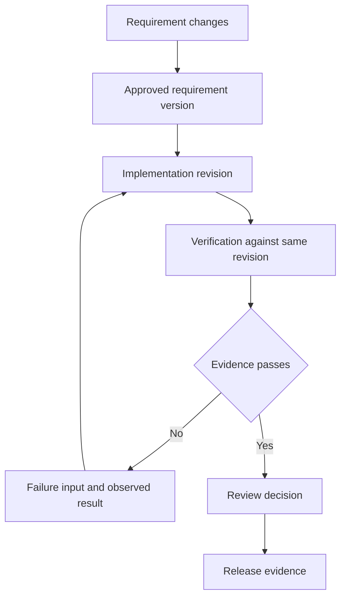

## Scenario and outcome

> **Source material incomplete.** The original interface contains internal project data; publishable task graphs, code changes, and verification records are missing.

Engineering moves through clarification, planning, implementation, verification, and release, with changes and failures along the way. A long conversation can obscure completed work and obsolete conclusions.

The Harness showcase assigns stages, dependencies, rollback, and human decisions to a Graph, with Agents executing within nodes. The following input-validation task is a reference graph. Internal project screenshots are not reproduced.

## Implementation approach

### Align graph and execution state

Prefer nodes with business artifacts rather than every internal thought. Overly fine nodes expose noise; coarse ones hide recovery points. Start with requirements, implementation, and verification.

Distinguish running tools, failed execution, and human decisions. The reference graph carries evidence back to implementation and requires a new revision before verification.

### Define node completion before execution

For “accept integers from 1 to 100,” the requirement node delivers bounds, error behavior, and examples. Planning identifies affected areas; implementation produces a revision; verification produces results bound to it.

A done message is insufficient. Code, version-specific checks, and deployed revision evidence establish different kinds of completion.

### Return actionable failure evidence

If 51 is accepted, return the input, observed and expected behavior, tested revision, and reproduction. Verify the replacement revision after repair.

An unavailable test environment is an infrastructure blocker, not evidence of a code defect. Distinguish code failure, environment failure, and human waiting to route recovery correctly.

### Version decisions and retries

Approval applies to a specific requirement or revision, not future changes. Retain attempt identity so a late result from an old attempt cannot replace the current result.

Record node, input version, and attempt. The Graph owns state transitions; the Agent explains and performs the work.

## Reuse guidance

Start with requirement, implementation, and verification nodes. Change requirements and cause a test failure to exercise invalidation and recovery before adding release. Every green state should resolve to current evidence.
