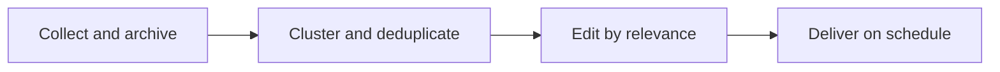

## Scenario and outcome

The station receives a continuous stream rather than a single question. It identifies events across repeated coverage, retains sources, and edits relevant changes into a brief.

Scheduled collection and editorial synthesis turn incoming technology news into a recurring brief.

This account is based on showcase material contributed by 信息站共创团队. The diagram and responsibility table organize that material; the worked example below is suggested implementation guidance, not a production measurement.

## Implementation approach

### How the work moves through the product

Separate collection, deduplication, topic grouping, and editing. Retain original sources and timestamps so readers can trace each conclusion.



Each transition should carry its input and result forward. This lets the next step use a specific artifact or observation rather than a conversational claim that work is complete.

### Responsibilities and authoritative facts

| Component | Responsibility |
|---|---|
| Collection | Sources and original content |
| Editor | Clustering, selection, summary |
| Publishing | Issue identity, timing, delivery |

Editorial selection and traceability matter more than filling a quota. Begin with known sources and explicit editing rules before expanding coverage.

### Follow one concrete request

Produce a morning brief from ten public test articles, linking every conclusion to its source and distinguishing events from signals.

1. **Collect and archive.** Retain source URLs, publication and retrieval times, and stable content keys.
2. **Cluster and deduplicate.** Group syndicated coverage by event while retaining supplemental sources.
3. **Edit by relevance.** Organize major events, ongoing topics, and weak signals with evidence and uncertainty.
4. **Deliver on schedule.** Check dates and links, preserve the issue manifest, and allow short issues when little changed.

The result needs to preserve the evidence used along the way. When a step lacks data or fails, keep that state visible rather than letting the next step treat it as a successful result.

### A result that can be checked

The following synthetic example makes the expected result concrete. It is an application-level example, not a QCA API request or an observed production record.

```json
{
  "input": {
    "articles": [
      {
        "id": "a",
        "event": "release-x"
      },
      {
        "id": "b",
        "event": "release-x"
      },
      {
        "id": "c",
        "event": "release-y"
      }
    ]
  },
  "expected": {
    "event_count": 2,
    "events": [
      {
        "id": "release-x",
        "sources": [
          "a",
          "b"
        ]
      },
      {
        "id": "release-y",
        "sources": [
          "c"
        ]
      }
    ]
  }
}
```

Count events rather than links while preserving both sources for the first event. Deduplication should not discard corroborating evidence.

## Reuse guidance

Start by reproducing the request above with a known input. Check the resulting state or artifact against the expected output, then add the following failure cases before widening the task scope.

| Failure or ambiguity | Required behavior |
|---|---|
| Three syndicated copies | Produce one event with multiple sources. |
| Old news republished | Distinguish event time from repost time. |
| Source temporarily unavailable | Report a coverage gap rather than reuse stale material as new. |