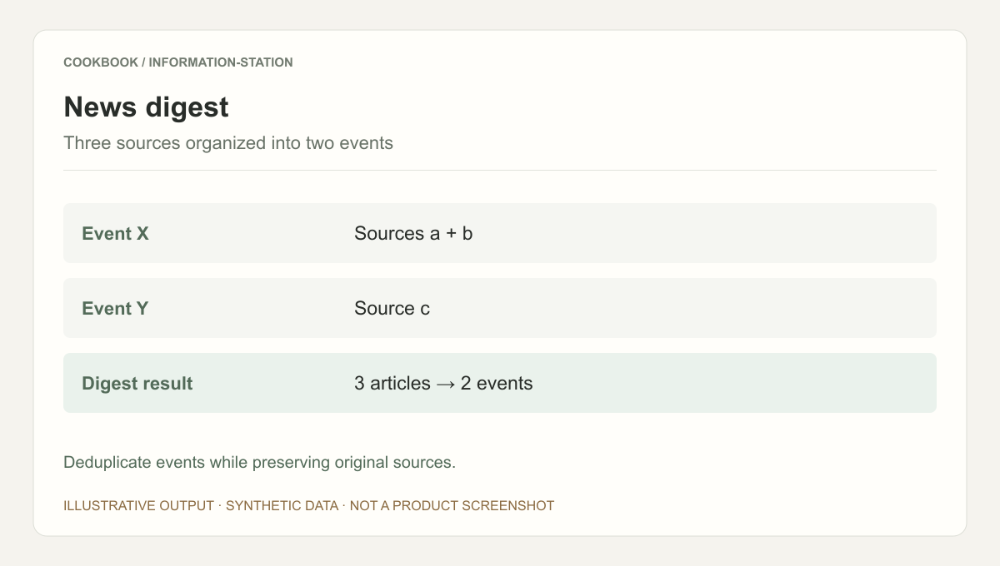
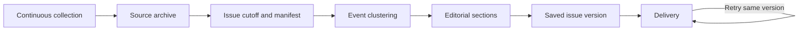

## Scenario and outcome

Information Station delivers an edited briefing rather than a search-result list. Its showcase describes ongoing collection, structuring, and aggregation, with an 08:30 briefing covering major items, follow-ups, weak signals, and product trends.

The source describes the workflow without publishing collectors or evaluations. The synthetic source exercise below develops an event-based editorial method.

Illustrative output based on this article’s example; synthetic data, not a product screenshot. Deduplicate events while preserving original sources.

## Implementation approach

### Separate collection and delivery cadence

Collection can be continuous while each issue has a frozen source manifest. Late material belongs to a later issue or explicit revision, not an unnoticed change during delivery retry.

Collectors acquire material, editors prioritize for an audience, and delivery sends a stable artifact. This separates source gaps, clustering errors, editorial distortion, and delivery failure.

### Define an issue boundary

Collection time, publication time, and event time differ. A repost today is not necessarily a new event; newly verified information about yesterday may still merit an update.

Persist the cutoff and source coverage. Report unavailable sources rather than filling a quota with stale material.

### Group events before editing

Sources A and B cover release X, while C covers Y. Produce two events, retaining both X sources. Deduplication must preserve corroborating or differing facts.

Similar titles may describe different events. Compare actor, action, version, and time, retaining unresolved disagreement.

### Give sections distinct editorial purposes

Major items prioritize attention; follow-ups explain changes; weak signals preserve uncertain leads; trends need evidence across events.

One release does not establish an industry trend. State uncertainty and what to watch next. Empty sections are preferable to unsupported entries.

### Carry corrections forward

Link summaries to sources and separate facts from editorial interpretation. Record corrections to prior issues when source details change.

A delivery timeout should retry the saved issue, not regenerate a different briefing under the same identity.

### From three sources to one issue

This synthetic walkthrough specifies what to inspect; it is not a recorded production run.

| Item | Evidence or condition | Decision |
|---|---|---|
| Source A | Covers release X | Retain original time |
| Source B | Adds details about X | Merge into X, keep citation |
| Source C | Covers separate release Y | Create a separate event |
| Issue | Two events, three sources | Check gaps before delivery |

## Reuse guidance

Run several issues over a limited source list and inspect duplicates, stale stories, broken links, and unsupported judgments. Evaluate new information and traceability, not word count. Preserve a replayable issue before expanding coverage.
