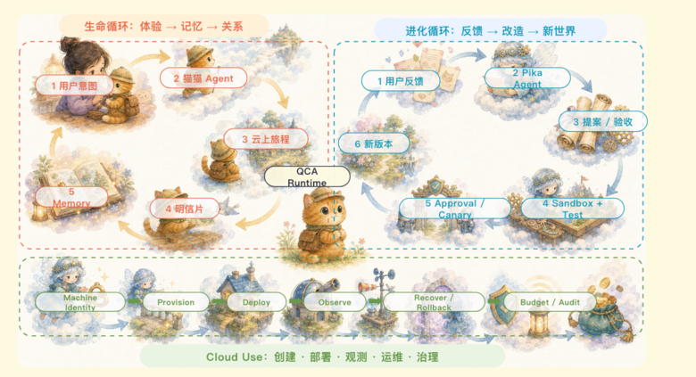
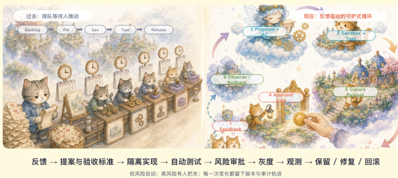

> This language version was automatically translated by AI.

## Scenario and outcome

In [LittleMemeWorld (Me&Me)](https://littlememeworld.com), every user owns a kitten of their own. After the user leaves the page, the kitten keeps travelling through the cloud world on schedule. It accumulates experiences and memories, and it brings back travel journals, photos, and growth results.


To let this cat keep living, we placed Qoder Cloud Agents (QCA) at the core of the product. The kitten's identity, long-term memory, scheduled behaviour, and tool capabilities are all carried by QCA. Every time a user returns, they see the same cat that has continued to grow, along with the new stories it left behind while they were away.


Once a trip ends, the results enter the travel journal. Users can review the story, the photos, and what was gained, and they can also make new choices. That response goes on to shape what the kitten does next.


Two loops run inside the product at the same time:

- **The life loop**: the user expresses intent, the kitten sets out to travel, brings back journals and memories, and then keeps living according to the user's choices;
- **The evolution loop**: the user submits feedback, the system forms a proposal and acceptance criteria, completes isolated development, testing, approval, canary release, and observation, and finally keeps the new version, continues fixing, or rolls back.



Both loops are already part of the real product path. QCA carries the daily operation of every cat while also carrying the multi-Agent workflow that continuously maintains LittleMemeWorld. The cat grows, and the software keeps changing along with user feedback.

## Implementation approach

### One cat consists of a set of long-lived resources

In the product, every cat is carried by a set of QCA resources that can be maintained independently:

| QCA resource | Responsibility in LittleMemeWorld |
|---|---|
| Template | Stores the shared persona boundaries, tools, files, and task rules, and records versions |
| Identity | Gives each cat a stable identity so that repeated runs always belong to the same product entity |
| Schedule | Triggers travel, maintenance, and other periodic tasks while the user is offline |
| Session | Keeps execution continuous within clear task boundaries and supports pause and resume |
| Memory | Stores preferences, experiences, diaries, and understanding of the world so the kitten keeps growing |
| Tools / Files | Lets the kitten read the world, produce results, and report back to the application under least privilege |


This set of resources gives the kitten a continuous identity and history. At the same time, login, permissions, rewards, idempotency, and release state are still managed by a deterministic application control plane. The Agent is free to plan trips and narrate what it sees, but every action that changes product facts must pass application validation.

| The QCA Agent is responsible for | The application control plane is responsible for |
|---|---|
| Understanding user intent and long-term context | Authentication, authorization, and resource ownership |
| Planning trips, forming observations and narrative | Business dates, uniqueness constraints, and idempotency |
| Using Memory to keep persona and experience continuous | Authoritative facts such as users, rewards, and release state |
| Calling restricted tools and producing structured results | Validating results, applying side effects, and user-visible state |

### Taking one piece of feedback all the way to production observation

We built a very direct entry point in the product called "Tell Pika." After users submit feedback, they can see it enter evaluation, implementation, or release, and they also receive a follow-up response.


This self-evolution pipeline already runs end to end. A piece of feedback goes through these stages in order:

1. An intake Agent reads feedback incrementally, removes sensitive data, and writes an append-only record;
2. An evaluation Agent clusters issues, organizes the impact scope, and forms a proposal and acceptance criteria;
3. A development Agent implements the change in an isolated environment and runs automated tests;
4. An independent review binds a specific version and exact SHA; historical conclusions cannot be reused directly;
5. Risk policy and human approval decide whether the change can merge and whether it can reach production;
6. The new version enters a canary and observation window while the system keeps monitoring real product results;
7. Based on observation evidence the system keeps the version, continues fixing, or rolls back, and writes back to the user.



We built approval, canary release, rollback, and circuit breaking directly into the pipeline. Different responsibilities use their own Identity, Session, tools, and permissions. The Agent that reads feedback has no production write access, and high-risk changes must be approved by an independent role and a human.

Every change leaves the same evidence chain:

> feedback → work item → Agent run → branch / PR → exact SHA → staging → production bundle → observation → verified

When evidence is missing, tests fail, versions do not match, or core metrics degrade, the pipeline stops, freezes, or rolls back. The team can follow this chain back to see where a change started, which judgments it passed through, and why it was finally kept or withdrawn.

### The two loops meet at structured facts

The life loop produces travel results, runtime signals, and user feedback. The evolution loop reads this evidence, turns it into a validated new version, and hands that version back to the life loop.

What the two loops exchange is structured facts and version evidence. The kitten in the product holds only the permissions it needs to finish a trip; development, release, and cloud resource operations are carried by separate Identities and tools. QCA runs through the whole product while preserving clear responsibility boundaries.

## Reuse guidance

The conclusion this LittleMemeWorld practice left us is direct: the runtime loop of a long-lived Agent and the software evolution loop can share one QCA foundation; the two loops exchange results through structured facts and version evidence while each keeps its own Identity, Session, tools, and permissions. This structure lets the product keep living, and it also lets the software keep evolving within clear boundaries.

### Worked implementation exercise

Use a test character for an offline trip and a feedback-driven change proposal, evaluating product behavior separately from software changes.

The following is a suggested implementation exercise, not a claim that the demonstration exposes this backend or that these checks have already passed. Use synthetic or authorized inputs. The JSON is an application-level record sketch, not a QCA API request.

### Step-by-step implementation

#### 1. Pin character context

Scope personality and memory to the test character.

#### 2. Trigger an activity

Associate schedules with story artifacts without duplicate events.

#### 3. Submit test feedback

Convert feedback into a scoped issue with acceptance criteria.

#### 4. Review the change

Inspect code, verification, and user experience before acceptance.

### Input and output record

```json
{
  "character": "test-cat",
  "activity": "demo-trip",
  "feedback": "test-feedback",
  "acceptance": [
    "memory-scope",
    "single-delivery",
    "verified-change"
  ]
}
```

Keep this record with the generated artifact or report. It should identify which input and version produced the result; keep sensitive credentials outside the record. If an input changes, do not silently reuse a result from the earlier version.

### Failure and acceptance checks

| Test condition | Expected result |
|---|---|
| Duplicate trigger | Avoid duplicate activity delivery. |
| Deleted memory | Do not reuse deleted information. |
| Ambiguous feedback | Clarify before changing behavior. |

Run each check with a reproducible input and retain actual observations. A plausible narrative is insufficient: compare the returned artifact, state, or numerical result with the expected behavior. Record incomplete checks rather than treating them as passes.

### Design tradeoff

Character continuity and software evolution are distinct validation targets; a successful story does not validate a change pipeline.
