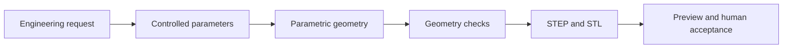

## Scenario and outcome

[Open the live piping CAD demonstration](https://hao2-llm2cad-pipeline.vercel.app)

An engineer asking for a DN150 long-radius 90-degree elbow needs an inspectable model and reusable files. He Ao’s industry showcase puts the engineering request, parameter table, 3D geometry, checks, and downloads in one workspace.

*Screenshot from the showcase collection; original demonstration by He Ao. This article summarizes the public page and observed interactions.*

### Try it in three minutes

1. Select the long-radius elbow and compare its request with the parameter table.
2. Rotate and zoom the model, switch between solid and wireframe views, and reset the camera.
3. Inspect the reported geometry checks, then download STEP or STL. A PNG preview is also available.

The page contains five predefined samples across flanges, elbows, and reducers. Selecting the DN150 long-radius elbow displayed outer diameter 168.3, wall thickness 7.11, centerline radius 229, and angle 90 degrees, with matching [STEP](https://hao2-llm2cad-pipeline.vercel.app/assets/step/elbow_dn150_lr.step) and [STL](https://hao2-llm2cad-pipeline.vercel.app/assets/stl/elbow_dn150_lr.stl) links. These values describe the sample, not an engineering specification for reuse.

The current public application is an **interactive viewer for precomputed examples**. It supports sample selection, inspection, and downloads; it does not expose arbitrary prompt input or live CAD generation.

## Implementation approach

### Make the artifact traceable

The public sample payload associates request text, structured parameters, geometry checks, and file paths. This creates a reviewable chain instead of an isolated rendering.

This is a delivery flow inferred from the presentation. The page names CadQuery and OpenCASCADE, but does not expose a generation service implementation or QCA session trace. Backend orchestration remains unverified.

| Layer | Visible evidence | Reusable design |
|---|---|---|
| Request | Component family and requested dimensions | Retain the original intent |
| Parameters | Sizes, angles, and radii | Store explicit controlled values |
| Preview | Shape and interfaces | Provide solid, wireframe, and reset controls |
| Checks | B-rep validity and mesh closure | Report deterministic tool results |
| Files | Associated STEP and STL exports | Treat files as first-class deliverables |

### Separate geometry checks from engineering acceptance

The elbow sample reports B-rep validity, mesh closure, and relative mesh volume deviation. These are page-reported results; they were not independently recomputed in a CAD kernel. Geometry validity alone does not establish material suitability, pressure rating, dimensional tolerances, or fitness for operating conditions.

The useful interaction is that checks sit next to the actual artifact. Reviewers can compare the request, parameters, geometry, and exports, making discrepancies easier to locate.

## Reuse guidance

Start with a few component families. Define a parameter schema, units, and allowed ranges for each; ask for missing values before invoking deterministic modeling tools. Generate geometry, run checks, and export files as separate steps.

Preserve the request, final parameters, tool versions, check reports, and artifact associations for every task. Acceptance should cover dimensional agreement and reopening exported files. A failed run must not deliver an older artifact as its own result.

The reusable pattern is request → parameters → geometry → checks → files. A QCA implementation would additionally need task execution, artifact storage, and failure recovery; those capabilities have not been established by inspecting this public viewer.
