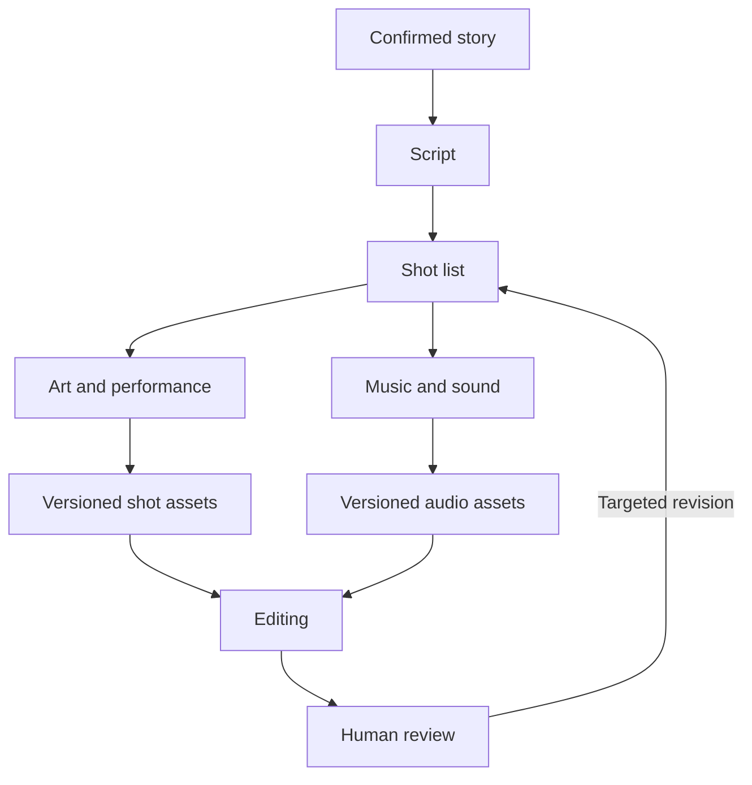

## Scenario and outcome

A film requires script, storyboard, art, performance, music, and editing. The Maqu showcase describes six specialist roles and a coordinator using long-running conversations, with both collaboration footage and a finished film.

The videos show different things: coordination and final audiovisual output. A finished film alone does not establish how every intermediate step was automated.

A frame from the original showcase film; the videos on this page show the full result. Source: original showcase material.

## Implementation approach

### Exchange artifacts between specialist conversations

Specialist conversations retain context, but peers need approved scripts, shot lists, and artifact references rather than entire chat histories. Keep unapproved ideas distinct from production inputs.

A revised shot should update dependent editing or sound work. The diagram organizes the source roles and dependencies, not a recorded execution trace.

### Approve the story before parallel production

Script work establishes story, characters, scenes, and dialogue; storyboarding turns that into shots. Premature asset generation can amplify rework when the story changes.

Parallelize tasks with stable inputs. The coordinator maintains shared constraints and the current version.

### Use shot-level handoffs

A shot handoff needs identity, script version, character reference, scene, action, duration target, sound requirements, and artifact references.

File existence is only one check. Verify usability, version, and creative fit before editing.

### Propagate a script revision

In the fixture, script v2 is approved while shot s01 uses a v1 asset. Review it before editing. A dialogue change may allow picture reuse; an action change may not.

Rework by impact instead of regenerating everything or accepting every old asset. Retain the decision rationale.

### Review the film across shot boundaries

Attractive individual shots can still fail as a sequence. Review character continuity, transitions, synchronization, music, and pacing across the film.

Final human review addresses creative coherence. Bind feedback to shots and versions for focused revision.

### Asset checks after script v2

This synthetic walkthrough specifies what to inspect; it is not a recorded production run.

| Item | Evidence or condition | Decision |
|---|---|---|
| Dialogue | Lines changed | Revise or review audio |
| Action | Character action changed | Review picture suitability |
| Music | Shot duration changed | Recheck timing |
| Editing | Old-version shots remain | Review versions before final assembly |

## Reuse guidance

Start with one short scene and a few shots, completing approval, handoff, edit, review, and revision. Use both videos to assess coordination and final output, not merely the number of Agents.
