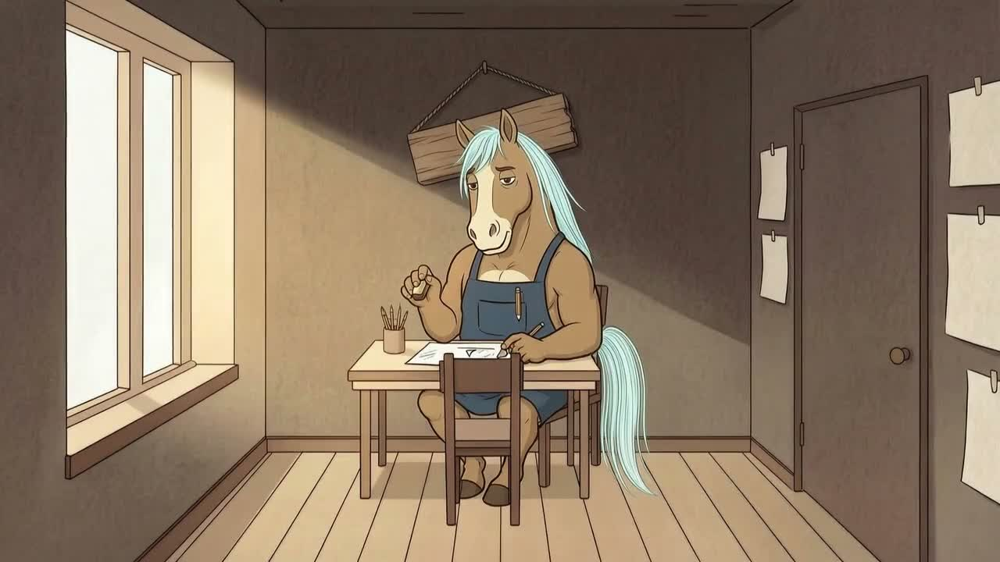
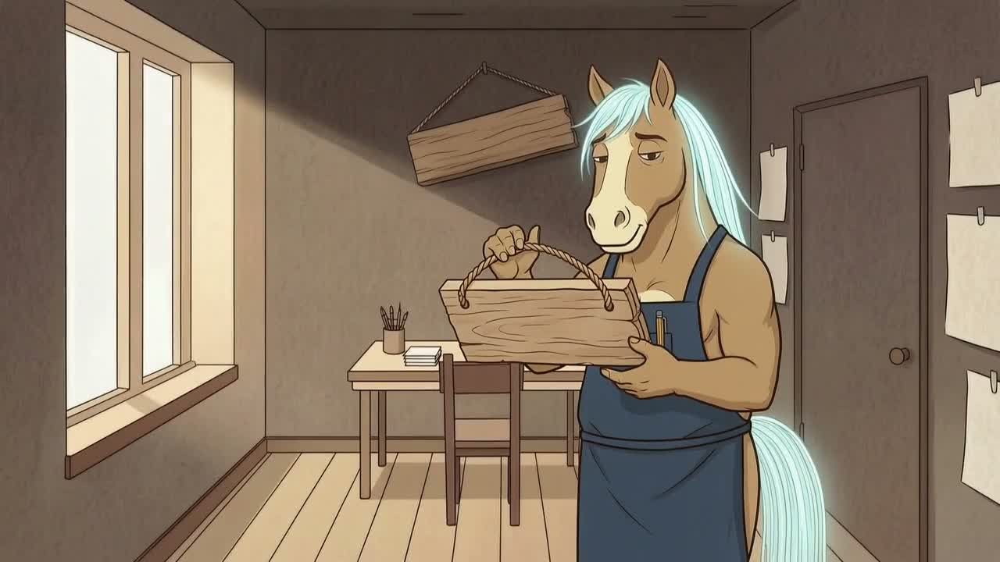
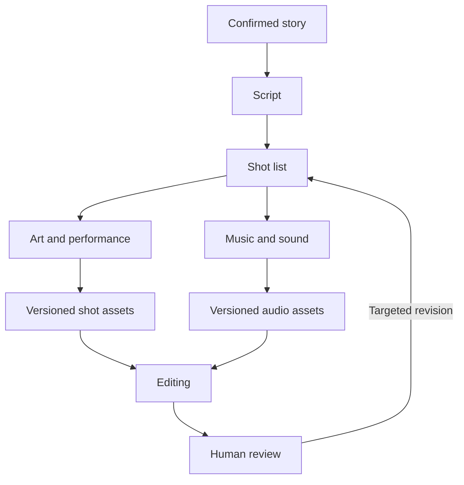

## Scenario and outcome

A film requires script, storyboard, art, performance, music, and editing. The Maqu showcase describes six specialist roles and a coordinator using long-running conversations, with both collaboration footage and a finished film.

The videos show different things: coordination and final audiovisual output. A finished film alone does not establish how every intermediate step was automated.

A frame from the original showcase film; the videos on this page show the full result. Source: original showcase material.

### Frames from the original video

01:30: the finished film shows the character writing at a desk.

03:30: the character holds a wooden basket; compare character design and scene continuity with the earlier frame.

These are frames from the original recording, not reconstructed interfaces. Use the video at the top of this page to view the surrounding sequence.

## Implementation approach

### Exchange artifacts between specialist conversations

Specialist conversations retain context, but peers need approved scripts, shot lists, and artifact references rather than entire chat histories. Keep unapproved ideas distinct from production inputs.

A revised shot should update dependent editing or sound work. The diagram organizes the source roles and dependencies, not a recorded execution trace.

### Approve the story before parallel production

Script work establishes story, characters, scenes, and dialogue; storyboarding turns that into shots. Premature asset generation can amplify rework when the story changes.

Parallelize tasks with stable inputs. The coordinator maintains shared constraints and the current version.

### Use shot-level handoffs

A shot handoff needs identity, script version, character reference, scene, action, duration target, sound requirements, and artifact references.

File existence is only one check. Verify usability, version, and creative fit before editing.

### Review the film across shot boundaries

Attractive individual shots can still fail as a sequence. Review character continuity, transitions, synchronization, music, and pacing across the film.

Final human review addresses creative coherence. Bind feedback to shots and versions for focused revision.

### The production roles recorded in the source

The showcase names script, storyboard, art, performance, music, and editing specialists, plus a coordinator: seven long-running conversations. This describes organization, not a claim that every role executes in parallel throughout production.

| Role | Production stage |
|---|---|
| Script | Iterative story development |
| Storyboard | Shot organization |
| Art | Scene and visual assets |
| Performance | Character portrayal |
| Music | Score |
| Editing | Assembly of the finished film |

The retained collaboration clip lasts about 64 seconds and the film about 5 minutes 45 seconds, measured from the provided files. Watch them together: collaboration and final output are different evidence. The new 01:30 and 03:30 frames can be located directly in the film and are not generated replacements.

## Reuse guidance

Start with one short scene and a few shots, completing approval, handoff, edit, review, and revision. Use both videos to assess coordination and final output, not merely the number of Agents.
