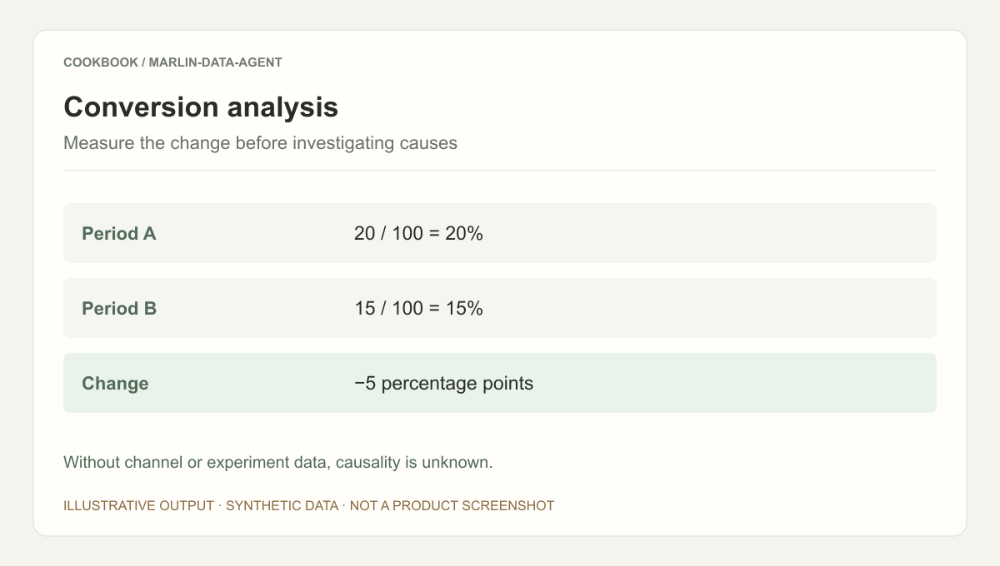
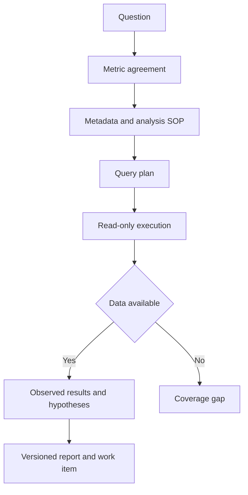

## Scenario and outcome

An analysis request often starts with “Why did conversion decline?” Answering it requires agreeing on definitions, finding tables, querying, interpreting differences, and returning a report to the requester. SQL generation alone does not complete the workflow.

权栩’s Marlin showcase describes five capabilities: metric clarification, SQL, data questions, analysis, and experiment reports. Its source also describes domain metadata and analysis SOPs, local Skill and remote MCP knowledge channels, and confirmed requests linked to report delivery. Synthetic numbers below explain the method, not business performance.

Illustrative output based on this article’s example; synthetic data, not a product screenshot. Without channel or experiment data, causality is unknown.

## Implementation approach

### Put knowledge and queries behind distinct checks

A reusable orchestration fixes definitions and a plan before querying, then writes from returned results. Clarification, absent data, and unsupported interpretation are different states. This diagram organizes the source’s responsibilities, not unpublished interfaces.

Associate each result table with a subquestion. Compare totals before launching unnecessary segmentation. The report may display progress but must not fill in values before query results arrive.

### Agree on definitions before choosing a method

Conversion may mean registration, ordering, or payment; new users may be defined by registration or first visit. Record numerator, denominator, observation window, deduplication entity, and timezone. A successful order query does not answer a payment question.

The source treats clarification as a distinct capability. A concise definition sheet allows the requester to correct assumptions before computation.

### Metadata and SOPs answer different questions

Table metadata describes fields and joins; an analysis SOP describes the method. Metadata without a method can produce isolated numbers, while a method without metadata cannot execute.

The source uses local Skills and remote MCP knowledge. Compare definitions and plans across the channels and record the selected version. Conflicting definitions need resolution, not averaging.

### Separate observations, hypotheses, and next checks

In a synthetic example, period A has 20 conversions from 100 eligible users; B has 15 from 100. The decline is five percentage points, or 25% relative. Label these differently.

No channel, cohort, or experiment data is provided, so the report cannot blame a release. Segment comparable data to locate the change, while keeping causal claims separate from descriptive findings.

### Deliver a reproducible report

Include the confirmed question, query version, result tables, conclusions, unresolved questions, and report reference. Link the requirement to this artifact rather than copying a context-free chat summary.

The source connects confirmation, work-item progress, and report writeback. Use stable request identity. Retry delivery when only writeback failed; rerun affected queries when the metric definition changes.

### A conversion-analysis delivery package

This synthetic walkthrough specifies what to inspect; it is not a recorded production run.

| Item | Evidence or condition | Decision |
|---|---|---|
| Confirmed definition | Same eligibility and observation window | Make periods comparable |
| Query result | 20/100 versus 15/100 | Retain numerator and denominator |
| Interpretation | Five points down; 25% relative decline | Distinguish absolute and relative change |
| Follow-up | Channel and cohort data missing | Keep causality unresolved |

## Reuse guidance

Start with a question family with human reference answers, then test conflicting definitions, empty results, and incomplete periods. Evaluate retrieval, interpretation, and reproducibility separately. Author-reported scale is not a quality evaluation of the current version.
