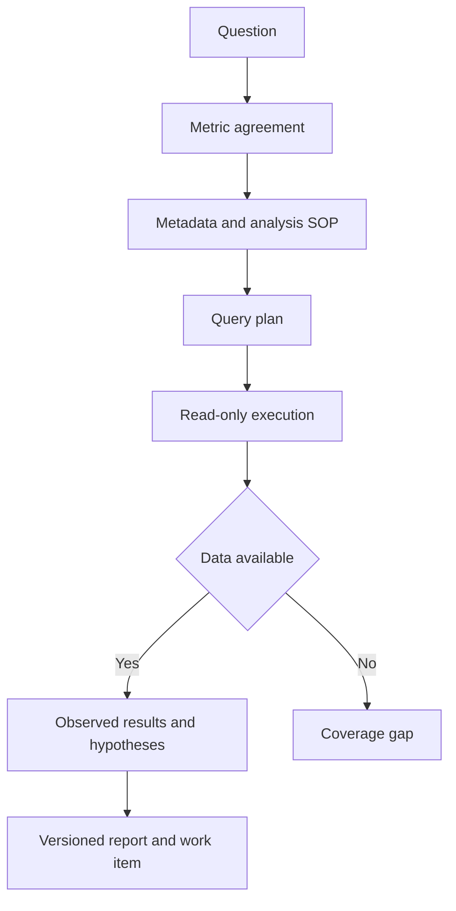

## Scenario and outcome

> **Source material incomplete.** A full source case description is available; public query and experiment-report screenshots are still missing.

An analysis request often starts with “Why did conversion decline?” Answering it requires agreeing on definitions, finding tables, querying, interpreting differences, and returning a report to the requester. SQL generation alone does not complete the workflow.

权栩’s Marlin showcase describes five capabilities: metric clarification, SQL, data questions, analysis, and experiment reports. Its source also describes domain metadata and analysis SOPs, local Skill and remote MCP knowledge channels, and confirmed requests linked to report delivery. The article focuses on the capabilities and delivery process described in the source.

## Implementation approach

### Put knowledge and queries behind distinct checks

A reusable orchestration fixes definitions and a plan before querying, then writes from returned results. Clarification, absent data, and unsupported interpretation are different states. This diagram organizes the source’s responsibilities, not unpublished interfaces.

Associate each result table with a subquestion. Compare totals before launching unnecessary segmentation. The report may display progress but must not fill in values before query results arrive.

### Agree on definitions before choosing a method

Conversion may mean registration, ordering, or payment; new users may be defined by registration or first visit. Record numerator, denominator, observation window, deduplication entity, and timezone. A successful order query does not answer a payment question.

The source treats clarification as a distinct capability. A concise definition sheet allows the requester to correct assumptions before computation.

### Metadata and SOPs answer different questions

Table metadata describes fields and joins; an analysis SOP describes the method. Metadata without a method can produce isolated numbers, while a method without metadata cannot execute.

The source uses local Skills and remote MCP knowledge. Compare definitions and plans across the channels and record the selected version. Conflicting definitions need resolution, not averaging.

### Deliver a reproducible report

Include the confirmed question, query version, result tables, conclusions, unresolved questions, and report reference. Link the requirement to this artifact rather than copying a context-free chat summary.

The source connects confirmation, work-item progress, and report writeback. Use stable request identity. Retry delivery when only writeback failed; rerun affected queries when the metric definition changes.

### Knowledge construction recorded by the author

The source distinguishes six areas served by digital employees from nine domains represented in the knowledge foundation. Metadata and SOP libraries serve different roles and should not be counted as the same coverage measure.

It reports 18 knowledge libraries, 197 tables, and 31 analysis SOPs at that stage, with additions focused on advertising and growth. These are dated author-reported figures, not current measurements made by this Cookbook.

### Three engineering iterations in the source

| Iteration | Documented approach | Significance |
|---|---|---|
| Knowledge | Local Skills and remote MCP RAG produce comparable analysis plans | Methods and retrieval can evolve separately |
| Delivery | Confirmed requests create work items and receive report links | Artifacts return to the request workflow |
| Runtime | QCA cloud deployment with a messaging entry | User entry is separate from persistent execution |

The original page also separates overall digital-employee delivery from a smaller cloud test stage. Their counts must not be combined. Public query traces and report screenshots are still missing, so this is a source-based system account rather than a complete task replay.

## Reuse guidance

Start with a question family with human reference answers, then test conflicting definitions, empty results, and incomplete periods. Evaluate retrieval, interpretation, and reproducibility separately. Author-reported scale is not a quality evaluation of the current version.
