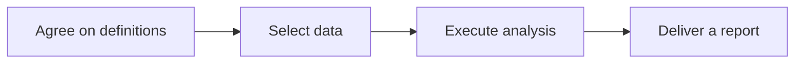

## Scenario and outcome

A business question leads through metric clarification, data discovery, queries, interpretation, and reporting. Marlin organizes that chain as a persistent analysis service.

Marlin connects metric definitions, SQL, data questions, analysis, and experiment reports in a knowledge-backed workflow.

This account is based on showcase material contributed by 权栩. The diagram and responsibility table organize that material; the worked example below is suggested implementation guidance, not a production measurement.

## Implementation approach

### How the work moves through the product

Start with one domain and authorized data. Preserve metric definitions, query versions, and time ranges alongside reports so conclusions remain reproducible.



Each transition should carry its input and result forward. This lets the next step use a specific artifact or observation rather than a conversational claim that work is complete.

### Responsibilities and authoritative facts

| Component | Responsibility |
|---|---|
| Knowledge | Metadata, metrics, and procedures |
| Agent | Compose queries and explanations |
| Data tools | Execute queries and retain results |

Reproducibility depends on data versions and definitions rather than report length. Retrieval supplies methods, query tools supply facts, and the model explains their scope.

### Follow one concrete request

Investigate a conversion-rate decline using synthetic event tables and deliver a report with metric definitions, query results, and evidence limits.

1. **Agree on definitions.** Specify new-user eligibility, conversion events, deduplication entity, timezone, numerator, and denominator.
2. **Select data.** Use metadata and analysis procedures to identify joins, permissions, and the relevant time range.
3. **Execute analysis.** Constrain read-only queries and retain SQL versions, result tables, and segment comparisons.
4. **Deliver a report.** Separate observations, hypotheses, and proposed experiments, linking the report to query evidence.

The result needs to preserve the evidence used along the way. When a step lacks data or fails, keep that state visible rather than letting the next step treat it as a successful result.

### A result that can be checked

The following synthetic example makes the expected result concrete. It is an application-level example, not a QCA API request or an observed production record.

```json
{
  "input": {
    "period_a": {
      "eligible": 100,
      "converted": 20
    },
    "period_b": {
      "eligible": 100,
      "converted": 15
    }
  },
  "expected": {
    "conversion_a": 0.2,
    "conversion_b": 0.15,
    "difference_percentage_points": -5
  }
}
```

The report can establish a five-percentage-point decline. Without channel, cohort, or experiment data, it cannot attribute the change to a product release.

## Reuse guidance

Start by reproducing the request above with a known input. Check the resulting state or artifact against the expected output, then add the following failure cases before widening the task scope.

| Failure or ambiguity | Required behavior |
|---|---|
| Conflicting definitions | Resolve the metric definition before querying. |
| Empty result | Report missing data rather than a trend. |
| Correlation presented as causation | Label hypotheses and propose a verification experiment. |