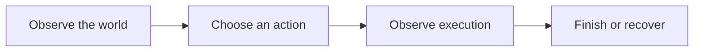

## Scenario and outcome

In Minecraft, players expect an Agent to act in the shared world. Position, obstacles, and player behavior continuously change its task context.

An embodied Agent shares a Minecraft world with players and responds through in-world actions.

This account is based on showcase material contributed by 残风. The diagram and responsibility table organize that material; the worked example below is suggested implementation guidance, not a production measurement.

## Implementation approach

### How the work moves through the product

Start with one task such as following or navigation. Record state before and after each action, separating model intent from actual execution and environmental feedback.



Each transition should carry its input and result forward. This lets the next step use a specific artifact or observation rather than a conversational claim that work is complete.

### Responsibilities and authoritative facts

| Component | Responsibility |
|---|---|
| Game interface | Observe state and execute actions |
| Agent | Choose the next action for a goal |
| State control | Stop, recovery, action bounds |

The world changes during inference. Short action horizons with state checks are easier to recover than long fixed plans; add long-term goals after the basic loop works.

### Follow one concrete request

Use following a player to a target area as a minimal exercise. The video illustrates interaction; this sequence is guidance for a similar implementation.

1. **Observe the world.** Read position, target, and nearby obstacles within the task scope.
2. **Choose an action.** Translate the goal into bounded move, stop, and replan actions.
3. **Observe execution.** Wait for game feedback and update state after obstacles instead of assuming arrival.
4. **Finish or recover.** Stop on arrival and handle player disconnects, unreachable paths, and cancellation explicitly.

The result needs to preserve the evidence used along the way. When a step lacks data or fails, keep that state visible rather than letting the next step treat it as a successful result.

### A result that can be checked

The following synthetic example makes the expected result concrete. It is an application-level example, not a QCA API request or an observed production record.

```json
{
  "input": {
    "target_distance": 1,
    "arrival_threshold": 2,
    "last_action": "move"
  },
  "expected": {
    "next_action": "stop",
    "goal_state": "reached"
  }
}
```

This simplified distance check verifies stopping on arrival. Navigation in complex terrain requires independent environment tests.

## Reuse guidance

Start by reproducing the request above with a known input. Check the resulting state or artifact against the expected output, then add the following failure cases before widening the task scope.

| Failure or ambiguity | Required behavior |
|---|---|
| Target moves | Replan from the new observation. |
| Blocked path | Avoid repeated ineffective actions and report the obstruction. |
| Stop request | Stop execution, not just the conversation. |