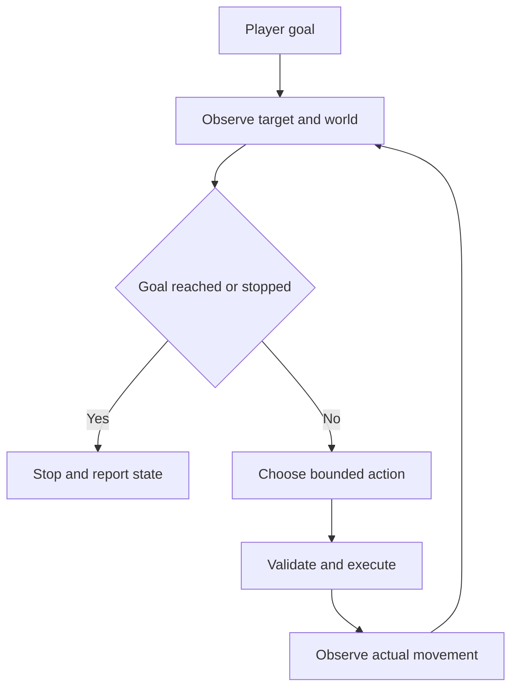

## Scenario and outcome

The Minecraft showcase places an Agent character in the player’s world. Its video demonstrates interaction beyond a chat window.

A video does not establish the navigation algorithm or control protocol. The approach-and-stop exercise below develops the observation/action boundary without attributing undocumented internals to the demo.

Original demo frame: the agent appears as a character in the player’s world. Source: original showcase material.

## Implementation approach

### Use a bounded world-action interface

A model can choose bounded operations instead of controlling every frame. The action layer checks task validity, stop requests, and permitted parameters, then returns observed effects.

Language, actions, and world state become independently testable. The reference loop does not identify an undisclosed navigation library.

### Translate a goal into observable conditions

“Come here” needs a target, distance, and stopping condition. The exercise uses a two-block threshold, not a claim about the demo. A moving target requires updated observations.

Determine arrival from world state rather than speech; appearance, dialogue, and action should refer to the same task.

### Observe after acting

Use bounded actions between observations so the player can stop or redirect and the Agent can respond to changes.

An accepted action request does not prove movement. Collisions, obstacles, and world changes require observing the outcome.

### Exercise three movement situations

Test open-ground arrival, an obstructed route, and a moving target or stop request. These establish success, blockage, and changed intent separately.

Report location and attempted actions when unreachable. Discard obsolete plans rather than repeatedly promising arrival.

### Read the demo at the right level

Use the video to inspect shared presence and understandable interaction. Latency and long-run stability need measurements beyond selected footage.

Reuse outcome verification across environments, while treating real-device control as a different capability boundary.

### Three observations while approaching

This synthetic walkthrough specifies what to inspect; it is not a recorded production run.

| Item | Evidence or condition | Decision |
|---|---|---|
| Far from target | Outside agreed range | Perform one bounded action |
| Within range | Distance 1, threshold 2 | Stop movement |
| Blocked path | No movement after action | Reassess the route |
| Target changed | Player specifies a new target | Invalidate the old plan |

## Reuse guidance

Start with movement and stopping, recording start and end positions. Check actual world outcomes alongside tool responses. Successful footage helps define experience goals without proving every failure path.
