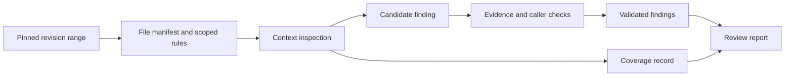

## Scenario and outcome

> **Source material incomplete.** The detailed source article is inaccessible; a publishable review report, associated diff, and coverage record are missing.

Sending a diff to a model can produce advice, but does not establish coverage, rule applicability, or reproducibility. The Open Code Review showcase separates deterministic scope and rule calculation from model judgment.

The source establishes scope and rule responsibilities; an actual review report is still needed.

## Implementation approach

### Organize review inputs and outputs

Compute a manifest before model review, then reconcile every file against it. Silence about a file is not evidence it was inspected.

Rules need scope: directory conventions should not become repository-wide policy. The reference flow aggregates findings and coverage separately so no findings cannot be confused with no inspection.

### Pin revisions and inspect context

Record base and target revisions, changed files, required context, and exclusions. Apply project rules to generated files, lockfiles, and business code rather than silently omitting large inputs.

Bind the report to its target revision even if the branch moves. Decide explicitly whether later commits need additional review.

### Report coverage independently

If two files changed and only one was inspected, no findings still means incomplete review. Distinguish checked, unchecked, excluded, and inconclusive scope with reasons.

Group repeated root causes without counting unseen instances as reviewed. Report length is not coverage.

## Reuse guidance

Use a small test repository with clear rules and retain report-to-revision links. Simulate missing context, truncated files, and read failures. Deliver findings and coverage; code changes and merging are separate tasks.
