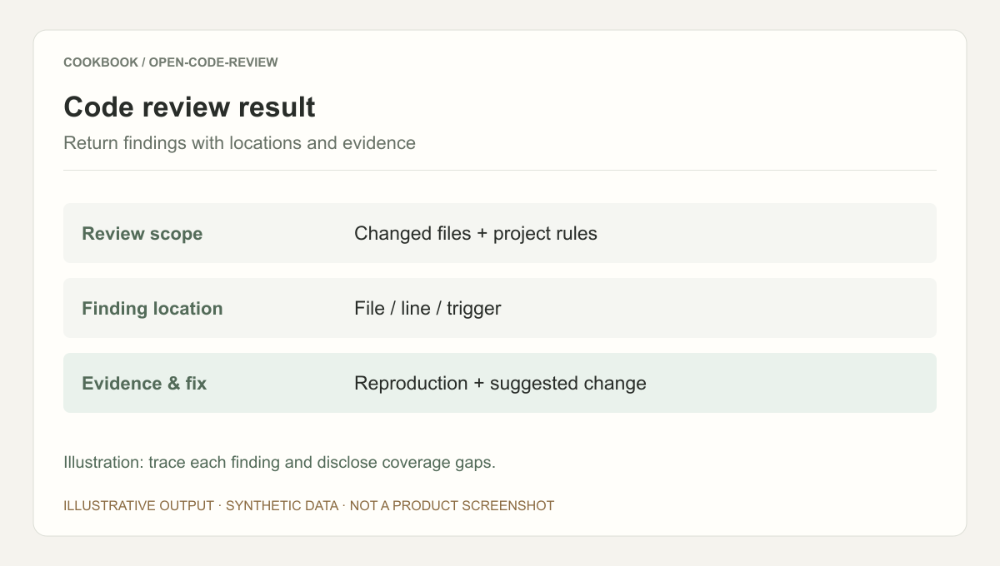
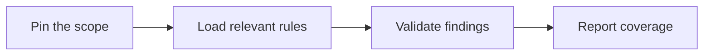

## Scenario and outcome

Review asks both which changes were examined and which findings merit action. Open Code Review joins scope, rules, and defect analysis in a review workflow.

Code review combines deterministic scope calculation, project rules, model analysis, and coverage evidence.

This account is based on showcase material contributed by 曲径/安辰. The diagram and responsibility table organize that material; the worked example below is suggested implementation guidance, not a production measurement.

### Result preview



Illustrative output based on this article’s example; synthetic data, not a product screenshot. Illustration: trace each finding and disclose coverage gaps.

## Implementation approach

### How the work moves through the product

Pin base and target revisions. Distinguish unchecked files from checked files without findings, and evaluate both known defects and false positives.



Each transition should carry its input and result forward. This lets the next step use a specific artifact or observation rather than a conversational claim that work is complete.

### Responsibilities and authoritative facts

| Component | Responsibility |
|---|---|
| Scope logic | Revisions and exclusions |
| Model | Code understanding and defect analysis |
| Reporting | Finding evidence and coverage |

Coverage and finding quality are separate. Use known-bug and clean examples to evaluate missed defects and false positives independently.

### Follow one concrete request

Review a test change containing a deliberate boundary bug and deliver actionable findings with coverage evidence.

1. **Pin the scope.** Record base and target revisions, changed code, context, and excluded files.
2. **Load relevant rules.** Apply project rules and necessary context without overwhelming defects with style comments.
3. **Validate findings.** Provide trigger, location, impact, and evidence; do not present speculation as a confirmed defect.
4. **Report coverage.** Distinguish checked, unchecked, and inconclusive areas before summarizing findings.

The result needs to preserve the evidence used along the way. When a step lacks data or fails, keep that state visible rather than letting the next step treat it as a successful result.

### A result that can be checked

The following synthetic example makes the expected result concrete. It is an application-level example, not a QCA API request or an observed production record.

```json
{
  "input": {
    "changed_files": [
      "a.py",
      "b.py"
    ],
    "reviewed_files": [
      "a.py"
    ],
    "findings": []
  },
  "expected": {
    "checked": [
      "a.py"
    ],
    "unchecked": [
      "b.py"
    ],
    "complete": false
  }
}
```

No findings applies only to reviewed scope. Expose unchecked files instead of presenting an empty finding list as comprehensive assurance.

## Reuse guidance

Start by reproducing the request above with a known input. Check the resulting state or artifact against the expected output, then add the following failure cases before widening the task scope.

| Failure or ambiguity | Required behavior |
|---|---|
| File exceeds context capacity | Report incomplete coverage. |
| Repeated instances | Group the root cause and affected locations. |
| No findings | State the reviewed scope without claiming universal correctness. |