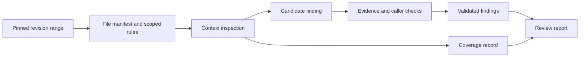

## Scenario and outcome

Sending a diff to a model can produce advice, but does not establish coverage, rule applicability, or reproducibility. The Open Code Review showcase separates deterministic scope and rule calculation from model judgment.

This walkthrough uses a synthetic boundary defect, not a finding against a real repository or a measured accuracy claim.

Illustrative output based on this article’s example; synthetic data, not a product screenshot. Illustration: trace each finding and disclose coverage gaps.

## Implementation approach

### Organize review inputs and outputs

Compute a manifest before model review, then reconcile every file against it. Silence about a file is not evidence it was inspected.

Rules need scope: directory conventions should not become repository-wide policy. The reference flow aggregates findings and coverage separately so no findings cannot be confused with no inspection.

### Pin revisions and inspect context

Record base and target revisions, changed files, required context, and exclusions. Apply project rules to generated files, lockfiles, and business code rather than silently omitting large inputs.

Bind the report to its target revision even if the branch moves. Decide explicitly whether later commits need additional review.

### Turn a suspicion into a finding

For an agreed minimum age of 18, synthetic code using age > 18 rejects the boundary value. A finding needs the rule, location, input, observed result, and impact.

Inspect callers as well: upstream handling may change whether a local expression causes a defect. Missing context warrants an unresolved question, not a confirmed finding.

### Report coverage independently

If two files changed and only one was inspected, no findings still means incomplete review. Distinguish checked, unchecked, excluded, and inconclusive scope with reasons.

Group repeated root causes without counting unseen instances as reviewed. Report length is not coverage.

### Verify fixes and evaluate the reviewer

After repair, check 17, 18, and 19 rather than only the reported boundary. Include a clean control change to detect false positives.

Known defects measure missed findings; clean samples measure false alarms. Finding one bug does not establish readiness for an automatic gate.

### A verifiable boundary finding

This synthetic walkthrough specifies what to inspect; it is not a recorded production run.

| Item | Evidence or condition | Decision |
|---|---|---|
| Rule | Minimum age is 18 | Cite the agreed requirement |
| Trigger | Input 18 | Exercise equality |
| Observed behavior | age > 18 rejects it | Inspect callers for impact |
| Verification | After repair, check 17, 18, 19 | Keep valid and invalid inputs |

## Reuse guidance

Use a small test repository with clear rules and retain report-to-revision links. Simulate missing context, truncated files, and read failures. Deliver findings and coverage; code changes and merging are separate tasks.
