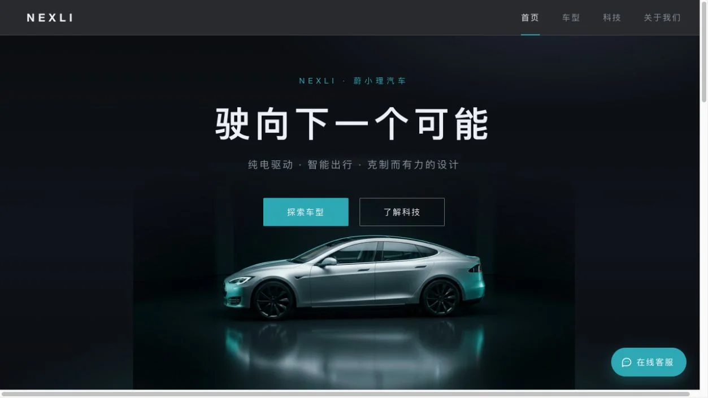
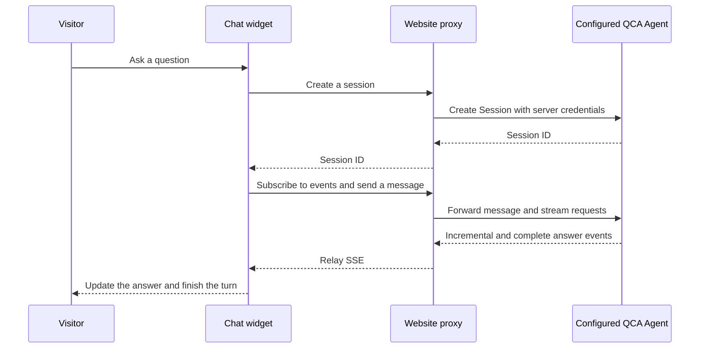

## Scenario and outcome

A company website may already contain product and service information, yet visitors still have to find the answers themselves. Adding a knowledge assistant also introduces integration questions: where to keep credentials, how to maintain a conversation, and how to recover when an answer stops arriving.

[portal-rag-assistant](https://github.com/kunlun322/portal-rag-assistant), published by kunlun322, adds a shared chat widget to a four-page brand demonstration website. A server-side proxy connects the widget to a preconfigured Qoder Cloud Agents question-answering Agent. The repository includes a local Node.js server and Vercel function endpoints.

This article reviews public implementation revision `eb1afef05af0565231e16e4bb3a6fc9da8d402b2`. The demonstrated outcome is an inspectable website integration, not evidence of an automotive company's production deployment. We did not run authenticated conversations or measure answer accuracy, support deflection, or cost savings.

| Boundary | Responsibility in the public implementation |
|---|---|
| Browser | Accept questions, maintain current conversation state, display answers |
| Website server | Read credentials from its environment and proxy session, message, and event requests |
| Configured QCA Agent | Handle the task using knowledge and configuration supplied by the integrator |

### Result preview

Demo portal: the customer-service entry opens product Q&A. Source: original showcase material.

## Implementation approach

### Connect through a small server-side proxy

The client calls three website endpoints: `/api/chat/session`, `/api/chat/message`, and `/api/chat/stream`. The server adds the PAT to upstream requests, so browser code does not need the upstream credential.

The reviewed version uses Forward session endpoints with Identity and Template configuration. Treat this as a version-specific integration: do not substitute Managed Mode Agent and Environment fields without checking the current API contract.

The following diagram summarizes the public client and proxy code:

The client calls its stream-opening function before sending the message. That is invocation order, not an explicit wait for stream readiness. Verify first-turn delivery under the current upstream connection behavior.

### Separate incremental rendering from the final answer

The client handles event types differently:

- `event_delta` appends answer fragments.
- `agent.message` replaces the assembled answer with the complete text.
- `session.status_idle` clears the busy state and shows an error if no answer arrived.

A noteworthy code comment explains that incremental frames in a turn may share an event ID. The implementation deduplicates discrete events by ID but does not apply that rule to every delta. This is a concrete rendering choice, not an exactly-once guarantee across all reconnect scenarios.

### Account for reconnection and rendering boundaries

The browser uses `EventSource`; the proxy forwards `Last-Event-ID`. A client inactivity timeout prevents indefinite waiting. These mechanisms still require interrupted-stream and reconnection tests to establish the actual user experience.

The client also applies an element and attribute allowlist after Markdown rendering. Agent output remains untrusted display content; a working chat experience does not justify rendering arbitrary HTML.

## Reuse guidance

Start with a narrow knowledge collection, such as product specifications and service FAQs. The repository supplies the website integration, not a self-contained knowledge indexing pipeline. A functioning widget alone does not demonstrate retrieval quality.

The following checks are recommendations for a new integration, not completed test results from this project:

| Check | Expected observation |
|---|---|
| Ask a covered question | Answer matches known material and supplies sources where required |
| Ask an uncovered question | Assistant acknowledges missing knowledge or routes to human support |
| Ask a follow-up | Context stays within the current visitor's conversation |
| Interrupt and restore connectivity | Answer recovery or failure is visible and understandable |
| Inspect browser requests and assets | No server PAT appears |
| Submit hostile HTML or links | Rendered output does not execute scripts or retain dangerous attributes |

Before exposing the proxy publicly, add caller authentication, session ownership checks, rate limiting, and usage controls. These were not present in the reviewed shared proxy file. Keeping the PAT server-side is useful, but does not establish tenant isolation when callers can supply a Session ID.

No third-party source code is reproduced; the interface image comes from the original showcase material. Check the original repository's license and asset permissions before reuse; public visibility does not grant redistribution under this Cookbook's licenses.

## Reference implementation

- [Repository and setup instructions](https://github.com/kunlun322/portal-rag-assistant)
- [Reviewed revision: server-side proxy](https://github.com/kunlun322/portal-rag-assistant/blob/eb1afef05af0565231e16e4bb3a6fc9da8d402b2/lib/qoder.js)
- [Reviewed revision: chat client](https://github.com/kunlun322/portal-rag-assistant/blob/eb1afef05af0565231e16e4bb3a6fc9da8d402b2/customer-service.js)
