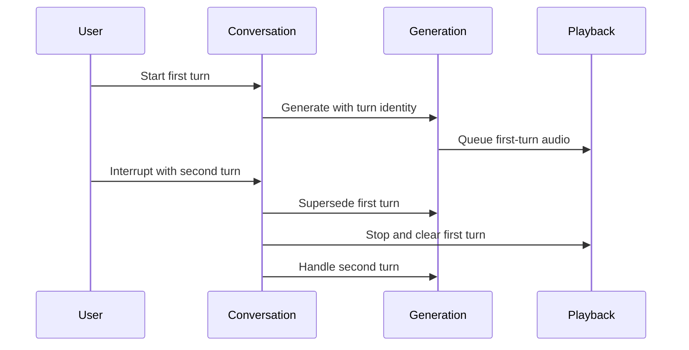

## Scenario and outcome

Xingyu presents a voice companion through topics such as happy moments, worries, and curiosity, with visible guidance for parents.

Listening, response, interruption, and ending shape the experience together. The following interaction contract does not infer backend models or complete safeguards from a public landing page.

Companion landing page with topic selection and a voice entry point. Source: original showcase material.

## Implementation approach

### Carry turn identity through text and audio

Input, text, and audio can arrive asynchronously. Associate them with one turn and let each consumer reject superseded output consistently.

Distinguish absent microphone input, a service failure, and playback failure rather than reporting all as misunderstood speech. The reference sequence emphasizes supersession without specifying a voice protocol.

### Make voice states understandable

A topic selection does not mean the microphone is listening. Connection, permission, and actual input are distinct steps with distinct failures.

Expose listening, thinking, speaking, and ended states instead of relying on an ambiguous animation.

### Interruption spans generation and playback

When the user interrupts, stop old audio, clear queued playback, and keep captions aligned with the new turn. Cancelling generation alone leaves buffered speech.

Turn identity helps reject late text and audio from the superseded response.

### Leave room for the next utterance

A short acknowledgment and a focused follow-up can leave room for the user. Long monologues increase interruption cost; evaluate conversational opportunity rather than response length.

Visible privacy guidance is useful but does not establish backend retention or protection behavior.

### Verify the end of the conversation

Ending should stop input, playback, and pending work for the turn. After disconnection, make recovery explicit instead of unexpectedly playing an old answer.

Test ending during listening, thinking, and speaking, not only after a normal response finishes.

### Four channels to check on interruption

This synthetic walkthrough specifies what to inspect; it is not a recorded production run.

| Item | Evidence or condition | Decision |
|---|---|---|
| Input | User starts turn two | Associate speech with the new turn |
| Generation | Turn one still emits output | Cancel or ignore old results |
| Playback | Old audio remains queued | Stop and clear the old queue |
| Captions | Old text arrives late | Do not append to the new turn |

## Reuse guidance

Test connection, interruption, silence, disconnection, and ending with short topics. Record state transitions and audible outcomes, and evaluate clarity with intended users. Speech capability alone does not establish long-term suitability.
