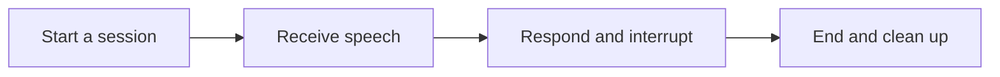

## Scenario and outcome

Voice companionship includes pauses, interruptions, and deliberate endings. This product makes conversational control visible alongside generated responses.

[Open the online entry](https://qca-realtime-agent.vercel.app/)

A realtime voice companion supports sharing and questions through conversational interaction.

This account is based on showcase material contributed by Qoder Agents 团队. The diagram and responsibility table organize that material; the worked example below is suggested implementation guidance, not a production measurement.

## Implementation approach

### How the work moves through the product

Validate interruption, mute, network failure, and ending a session. Child-oriented experiences also require guardian awareness, minimal data collection, and age-appropriate content.



Each transition should carry its input and result forward. This lets the next step use a specific artifact or observation rather than a conversational claim that work is complete.

### Responsibilities and authoritative facts

| Component | Responsibility |
|---|---|
| Voice UI | Capture, playback, ending controls |
| Agent | Interpret input and form responses |
| Session control | Turns, cancellation, data handling |

Companionship depends on turn-taking and user control as much as fluent speech. Stabilize stop, interruption, and reconnection before adding inspectable, deletable memory.

### Follow one concrete request

Use an adult test account to share a daily event and verify listening, response, interruption, and session ending without collecting children’s recordings.

1. **Start a session.** Make microphone state, purpose, and ending controls explicit before capture.
2. **Receive speech.** Track turns and silence with clear listening and processing states.
3. **Respond and interrupt.** Allow interruption and discard obsolete queued output.
4. **End and clean up.** Stop capture and playback, apply the retention policy, and show a closed state.

The result needs to preserve the evidence used along the way. When a step lacks data or fails, keep that state visible rather than letting the next step treat it as a successful result.

### A result that can be checked

The following synthetic example makes the expected result concrete. It is an application-level example, not a QCA API request or an observed production record.

```json
{
  "input": {
    "playing_turn": "t1",
    "new_user_turn": "t2"
  },
  "expected": {
    "cancel_playback": "t1",
    "active_turn": "t2"
  }
}
```

Content appropriateness and turn-state correctness are separate checks. First ensure that obsolete speech is not mixed with the new turn.

## Reuse guidance

Start by reproducing the request above with a known input. Check the resulting state or artifact against the expected output, then add the following failure cases before widening the task scope.

| Failure or ambiguity | Required behavior |
|---|---|
| User interrupts | Stop old playback and isolate the new turn. |
| Network loss | Show disconnection rather than waiting indefinitely. |
| Speech after ending | Do not capture or respond after closure. |