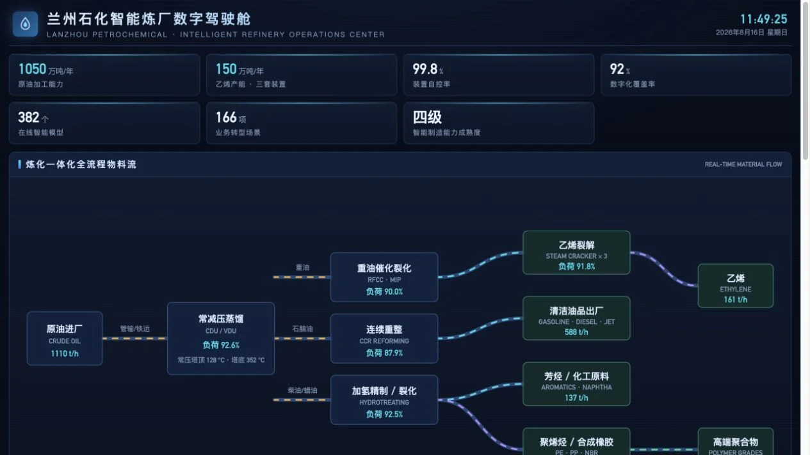
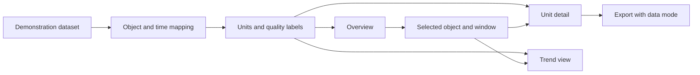

## Scenario and outcome

The refinery cockpit brings unit load, material flow, trends, and safety information into a global view. The demo illustrates domain-oriented information organization.

Operational readings are simulated, not a production connection. Use it to study representation and navigation, not to assess actual equipment or make process decisions.

Demo cockpit showing unit loads and material flow; operational readings are simulated. Source: original showcase material.

## Implementation approach

### Normalize data before visualization

A data adapter reconciles object identity and time while retaining source units, quality, and windows. Do not silently fill gaps merely to connect a chart; label any interpolation.

Visualization presents these facts. Generated explanations should refer to selected objects and windows. The reference flow does not imply a live production feed.

### Design a reading order before adding metrics

An overview should identify what needs attention, then support tracing units, neighbors, and change over time. Equal-sized metrics obscure priority; color alone does not explain it.

Preserve units, object, window, and data mode, separating static context from dynamic demo readings.

### Follow one material path

Trace an inlet through processing units to products, distinguishing node and edge measures. Load percentage and flow are different quantities and cannot be added or directly compared as efficiency.

Make comparison windows explicit and label missing or stale data rather than silently substituting zero.

### Preserve context in drill-down

Detail views should retain unit identity, time range, and neighbors; returning should preserve selection.

Carry simulation labeling into detail and exports. A footer-only label is easily lost when screenshots or reports leave the page.

### Explain alert state and evidence

An alert needs object, time, rule or threshold, and current validity. Otherwise users cannot distinguish an active issue, history, and an animation.

Use domain-approved rules for a real implementation; generated descriptions are not automatic control instructions.

### Reading one material path

This synthetic walkthrough specifies what to inspect; it is not a recorded production run.

| Item | Evidence or condition | Decision |
|---|---|---|
| Node | Unit load percentage | Identify unit and time |
| Edge | Material flow | Retain flow units |
| Trend | Change over a window | Align with overview window |
| Export | Report outside the page | Preserve simulated-data label |

## Reuse guidance

Validate one material path and unit before expanding views. Check units, windows, linked selection, missing data, and export labels. Aim for understandable, traceable information rather than metric density.
