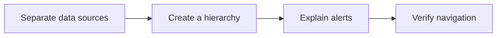

## Scenario and outcome

A refinery overview brings units, material flow, trends, and alerts into a readable surface. This demonstration guides readers from global changes to individual metrics.

[Open the online entry](https://hao2-lzsh-refinery.vercel.app)

A refinery cockpit organizes unit loads, material flow, trends, and safety indicators using demonstration data.

This account is based on showcase material contributed by 何傲. The diagram and responsibility table organize that material; the worked example below is suggested implementation guidance, not a production measurement.

## Implementation approach

### How the work moves through the product

Label static context, simulated readings, and live data separately. The public page is a cockpit demonstration, not evidence of a production integration.



Each transition should carry its input and result forward. This lets the next step use a specific artifact or observation rather than a conversational claim that work is complete.

### Responsibilities and authoritative facts

| Component | Responsibility |
|---|---|
| Data | Source, units, timestamps |
| Cockpit | Overview, trends, details |
| Explanation | Alert evidence and data identity |

The public cockpit is a demonstration. If an Agent explains its values, preserve the simulation label so the report cannot be mistaken for production evidence.

### Follow one concrete request

Inspect a simulated unit-load change from overview to trend and alert timeline, focusing on clear data semantics.

1. **Separate data sources.** Distinguish public background facts, simulated readings, and future live inputs.
2. **Create a hierarchy.** Use overview for location, trends for timing, and details for values and units.
3. **Explain alerts.** Attach thresholds, windows, and observations rather than relying on color alone.
4. **Verify navigation.** Replay a fixed simulated event and reconcile overview with detail.

The result needs to preserve the evidence used along the way. When a step lacks data or fails, keep that state visible rather than letting the next step treat it as a successful result.

### A result that can be checked

The following synthetic example makes the expected result concrete. It is an application-level example, not a QCA API request or an observed production record.

```json
{
  "input": {
    "data_mode": "simulation",
    "load_percent": 72
  },
  "expected": {
    "label": "simulated load",
    "production_claim": false
  }
}
```

Preserve data identity across overview, detail, and exports rather than relying on a single footer label.

## Reuse guidance

Start by reproducing the request above with a known input. Check the resulting state or artifact against the expected output, then add the following failure cases before widening the task scope.

| Failure or ambiguity | Required behavior |
|---|---|
| Stale feed | Display staleness instead of a live indicator. |
| Mixed units | Label units and avoid ambiguous axes. |
| Alert clears | Retain occurrence and resolution times. |