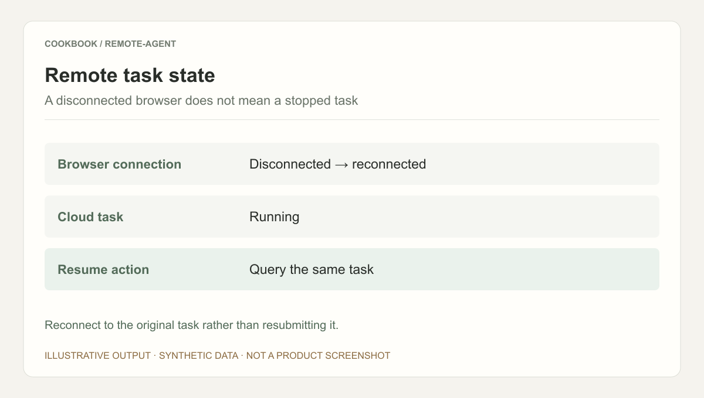
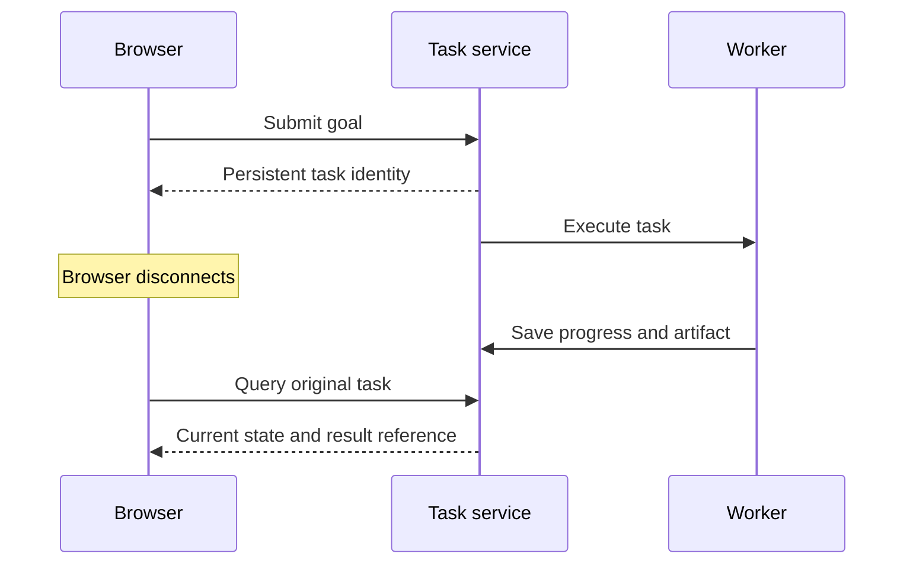

## Scenario and outcome

Remote Agent turns cloud execution into an end-user product: submit a goal, let work continue, and return to its progress and artifacts. The showcase describes work independent of a continuously connected local computer.

The report example below examines persistent task identity and recovery. Its application states are reference design, not claims about the public service’s internals.

Illustrative output based on this article’s example; synthetic data, not a product screenshot. Reconnect to the original task rather than resubmitting it.

## Implementation approach

### Connect a long-running task to its interface

An event stream observes progress; the task record anchors recovery. Reconcile a current snapshot and unread events with ordering information rather than trusting cached UI state.

Execution completion, artifact availability, and user viewing are different events. A failed download need not regenerate the report. This sequence is an integration design, not the public service protocol.

### Make submission recoverable

Clicking send is not proof of admission. A task identifier enables later lookup. A timeout without an identifier is ambiguous; a request idempotency key can support reconciliation rather than duplicate submission.

Expose title, creation time, goal, and state outside transient chat memory.

### Separate connection and execution state

Closing a page or sleeping the computer affects the client, while the task may continue, wait, or fail. Reconnect by querying the original task rather than replaying a stale progress display.

Show the last event and waiting reason. Silence is not necessarily failure, and an endless spinner conveys little.

### Deliver artifacts with completion evidence

A reporting task needs a readable artifact tied to the current input and output contract. A completion message cannot substitute for a file. Preserve version and usage context.

Distinguish a preview error from absent output. Do not present an empty link as successful delivery.

### Distinguish cancel, retry, and continue

Cancel requests a stop and may leave partial artifacts. Retry repeats failed work. Continue supplies information to the existing task. Controls should reflect these differences.

Track which completed outputs a changed requirement invalidates, such as a revised report window.

### Interpreting a reconnected task

This synthetic walkthrough specifies what to inspect; it is not a recorded production run.

| Item | Evidence or condition | Decision |
|---|---|---|
| Running | Current state of original task | Observe without resubmitting |
| Waiting | Task requests clarification | Answer within the same task |
| Artifact ready | Output matches this task | Check readability and deliver |
| Failed | Failure stage is known | Retry by stage |

## Reuse guidance

After confirmed submission, close and reopen the page and compare identity, history, and artifacts. Test waiting, cancellation, and failure. Judge whether users can understand state and find results, not merely resume chat.
