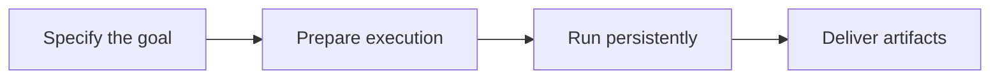

## Scenario and outcome

Users expect a submitted goal to survive closing the page. Remote Agent exposes cloud execution, persistent state, and artifact delivery through a task interface.

[Open the online entry](https://qoder.com/agents/session/new)

A web task interface exposes cloud execution, progress, and artifacts without requiring the local device to stay connected.

This account is based on showcase material contributed by Qoder Agents 团队. The diagram and responsibility table organize that material; the worked example below is suggested implementation guidance, not a production measurement.

### Result preview


Illustrative output based on this article’s example; synthetic data, not a product screenshot. Reconnect to the original task rather than resubmitting it.

## Implementation approach

### How the work moves through the product

Start with an explicit file deliverable. Verify reconnect behavior, persistent task state, artifact retrieval, and whether cancellation actually stops execution.



Each transition should carry its input and result forward. This lets the next step use a specific artifact or observation rather than a conversational claim that work is complete.

### Responsibilities and authoritative facts

| Component | Responsibility |
|---|---|
| Task UI | Goals, progress, artifact access |
| Agent and environment | Planning and execution |
| Task store | Persistent state and artifact links |

Persistent execution needs observable state rather than an indefinite spinner. Explain current work, dependencies, and artifact availability.

### Follow one concrete request

Submit a comparison report over three test documents, leave the page, and return to verify task and artifact continuity.

1. **Specify the goal.** Define input documents, output format, and completion criteria.
2. **Prepare execution.** Make inputs available and record tool scope, reporting missing files explicitly.
3. **Run persistently.** Keep task state independent of the browser, exposing running, waiting, and failed stages.
4. **Deliver artifacts.** Provide a downloadable report and citations that remain associated with the same task after reconnection.

The result needs to preserve the evidence used along the way. When a step lacks data or fails, keep that state visible rather than letting the next step treat it as a successful result.

### A result that can be checked

The following synthetic example makes the expected result concrete. It is an application-level example, not a QCA API request or an observed production record.

```json
{
  "input": {
    "task": "running",
    "browser": "disconnected"
  },
  "expected": {
    "task": "running",
    "resume_ui": "query same task"
  }
}
```

Browser connection state is separate from task state. Reconnect to the same task instead of resubmitting and creating duplicate work.

### Try the workflow yourself

The following is a reproduction exercise using test data. It illustrates the application workflow, not a claim about undocumented internals of the original product.

> Start a test reporting task and retain its identifier. Reopen the same task after closing the page and verify history, state, and artifacts without resubmitting.

Disconnect only after confirming the task was submitted. Reopen by identifier and display its current state. A browser disconnection is not a reason to rerun; retry requires a known task failure and supported recovery path.

### Read the outcome, then try a counterexample

Change only one condition: **Browser closed**. Expected behavior: Preserve the task and expose state after reconnection. Keep the original run alongside the changed run so you can distinguish a changed decision from a missing output.


## Reuse guidance

Start by reproducing the request above with a known input. Check the resulting state or artifact against the expected output, then add the following failure cases before widening the task scope.

| Failure or ambiguity | Required behavior |
|---|---|
| Browser closed | Preserve the task and expose state after reconnection. |
| Task cancelled | Stop execution or report that cancellation is pending. |
| Empty report artifact | Fail content validation despite file presence. |