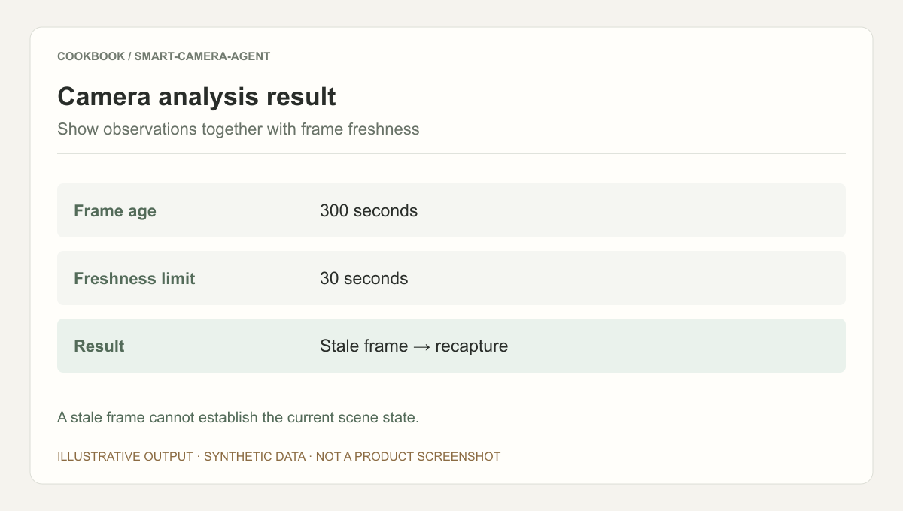
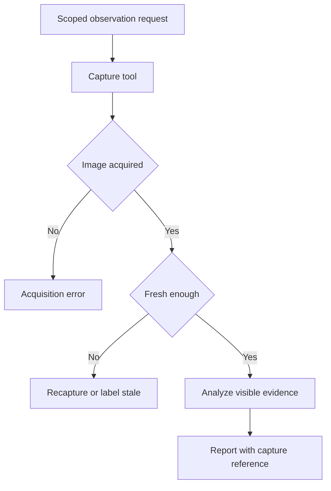

## Scenario and outcome

The camera showcase uses QCA Forward and Skills to connect existing cameras, capture frames, and produce analysis. A video demonstrates the interaction path.

The original still contains device and workplace details, so this article uses a synthetic freshness exercise. Seeing an image is different from establishing the current scene.

Illustrative output based on this article’s example; synthetic data, not a product screenshot. A stale frame cannot establish the current scene state.

## Implementation approach

### Associate tool results with the observation request

Bind request, authorized device, capture time, and observation goal to the analysis. A filename alone cannot explain an old report after a later capture overwrites the file.

Skills also need structured failure and stale-input results. The reference flow is independent of a particular device SDK.

### Specify target and freshness

A request for the current scene needs an authorized target, observation goal, and maximum frame age. Return capture time and device reference so a file can be tied to this request.

Keep device selection within authorized scope rather than letting generated identifiers expand access.

### Separate capture, freshness, and interpretation

Check capture success, then age, then visible content. Sharpness does not establish freshness, and blur does not establish device failure.

A 300-second-old frame with a 30-second limit requires recapture. If recapture fails, any retained observation must remain historical.

### Separate visible evidence from inference

Describe visible facts before uncertain interpretation or follow-up needs. A single frame does not prove sustained behavior, and blind spots do not establish absence.

Associate observations with regions and capture time. Questions about change require comparable new frames or sequences.

### Return useful acquisition failures

Differentiate connection failure, capture timeout, stale input, and inconclusive interpretation. Route recovery to acquisition when needed rather than rerunning analysis on unchanged evidence.

Keep public reports limited to necessary observations; detailed device diagnostics belong in the authorized troubleshooting path.

### From frame to observation report

This synthetic walkthrough specifies what to inspect; it is not a recorded production run.

| Item | Evidence or condition | Decision |
|---|---|---|
| Acquisition | Image with capture time | Match to this request |
| Freshness | 300 seconds, limit 30 | Recapture before current-scene claims |
| Recapture failure | Only stale input remains | Label as historical |
| Fresh frame | Within the agreed age | Describe visible evidence and limits |

## Reuse guidance

Test one authorized device and a clear goal, then stale, timed-out, and blurry inputs. Verify capture-time provenance, uncertainty, and replacement of obsolete results after recapture.
