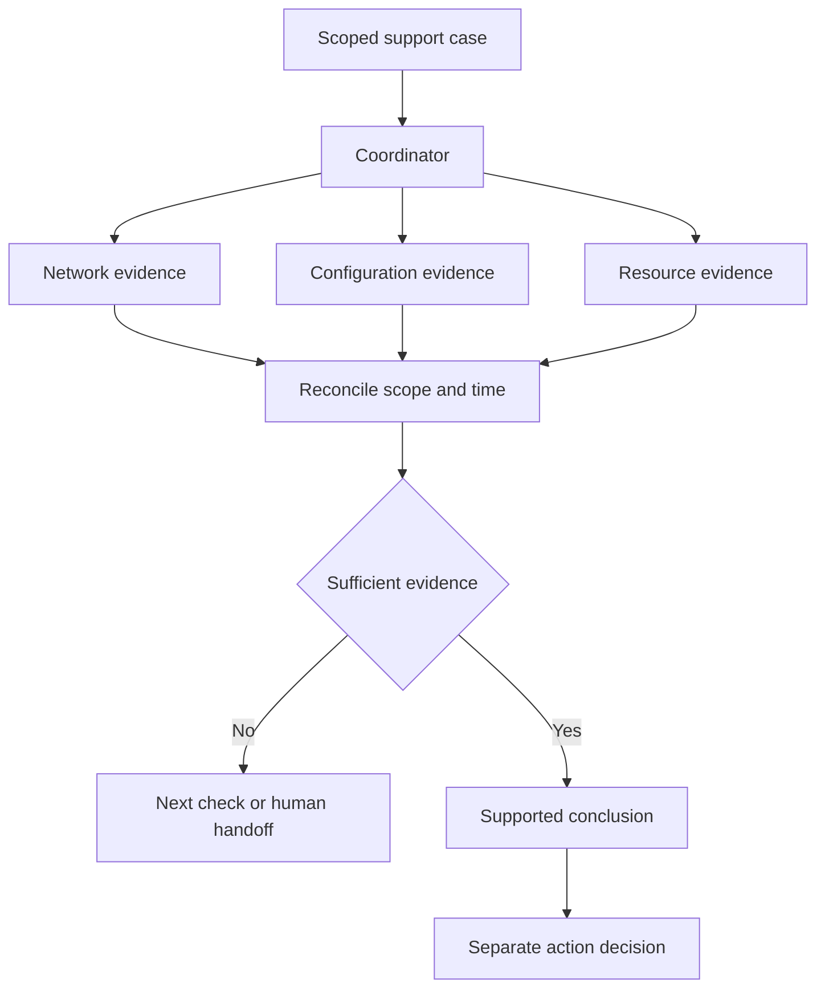

## Scenario and outcome

Technical support combines customer descriptions, team knowledge, configuration checks, and current resource state. Handoffs can lose context and repeat questions.

The TAM digital-twin showcase describes a messaging-based coordinator routing to specialists with knowledge, Skills, memory, credentials, and diagnostics. This timeout exercise explains the handoffs without claiming measured resolution improvements.

Illustrative output based on this article’s example; synthetic data, not a product screenshot. Collect configuration evidence before claiming a cause.

## Implementation approach

### Make the investigation transferable

Maintain the question, known evidence, and open hypotheses instead of treating the latest reply as all context. Reconcile target, window, and result version before updating the case.

Hand the same case state to a human for continuation. The reference flow separates evidence synthesis from action decisions.

### Build an investigation context

“Cannot connect” needs a target, window, symptom, recent changes, and prior checks. Distinguish customer reports from tool observations.

Historical memory suggests investigation paths; a previous root cause is not evidence for the present incident.

### Keep one case across specialists

Give specialists the same case identity and scope. Return observations, timestamps, execution status, and gaps from network, configuration, or resource checks.

Handle credential references and scope in integration code. A denied query is an access gap, not evidence that a resource is absent.

### Narrow a timeout investigation

Initially, a network check times out and configuration evidence is missing. Report the symptom, unresolved cause, and next configuration check. Use new evidence to choose the next discriminating test.

Repeating a timeout can establish persistence without explaining cause. Prefer checks that distinguish hypotheses.

### Hand over evidence, not just a diagnosis

Record scope, completed checks, excluded and open hypotheses, next action, and owner. The next operator should know what remains valid and what needs rechecking after a change.

Separate recommendations from actions. After an action, observe whether the original symptom disappeared instead of closing on tool success alone.

### Evidence states in a timeout investigation

This synthetic walkthrough specifies what to inspect; it is not a recorded production run.

| Item | Evidence or condition | Decision |
|---|---|---|
| User report | Connection unavailable | Record scope and time |
| Tool observation | Network check timed out | Establish symptom, not cause |
| Evidence gap | Configuration check missing | Obtain configuration evidence |
| New evidence | Configuration result available | Revise or withdraw the hypothesis |

## Reuse guidance

Use one error family and a test environment with normal, faulty, and missing-evidence samples. Check scope retention, updated judgments, and actionable escalation. Confidence of wording is not diagnostic quality.
