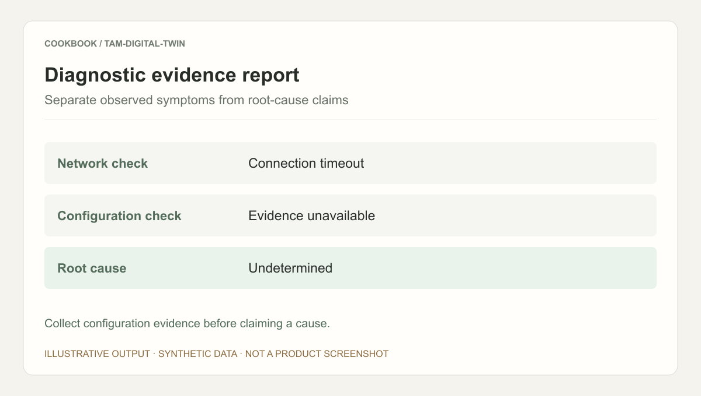
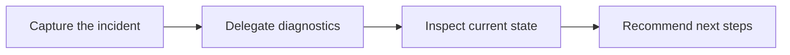

## Scenario and outcome

Industry troubleshooting combines accumulated expertise with current resource observations. The support twin connects a collaboration entry point, specialized knowledge, and diagnostics.

A persistent support entry routes industry troubleshooting tasks to specialized knowledge and resource diagnostics.

This account is based on showcase material contributed by 俊行. The diagram and responsibility table organize that material; the worked example below is suggested implementation guidance, not a production measurement.

### Result preview



Illustrative output based on this article’s example; synthetic data, not a product screenshot. Collect configuration evidence before claiming a cause.

## Implementation approach

### How the work moves through the product

Use a shared incident timeline and resource identifiers. Separate retrieved guidance from current tool observations, and authorize remediation independently.



Each transition should carry its input and result forward. This lets the next step use a specific artifact or observation rather than a conversational claim that work is complete.

### Responsibilities and authoritative facts

| Component | Responsibility |
|---|---|
| Coordinator | Incident context and routing |
| Specialists | Retrieval and specialized diagnostics |
| Tools | Current observations and call status |

Parallel diagnostics require shared incident context. More Agents cannot compensate for missing identifiers or timestamps; standardize evidence before parallelizing.

### Follow one concrete request

Investigate a test cloud instance connection timeout using guidance, resource observations, and an incident timeline.

1. **Capture the incident.** Collect resource identifiers, symptoms, onset time, and scope.
2. **Delegate diagnostics.** Separate network, configuration, and knowledge checks under the same incident scope.
3. **Inspect current state.** Timestamp read-only observations and distinguish them from historical guidance.
4. **Recommend next steps.** Rank candidate causes with supporting and missing evidence; authorize remediation separately.

The result needs to preserve the evidence used along the way. When a step lacks data or fails, keep that state visible rather than letting the next step treat it as a successful result.

### A result that can be checked

The following synthetic example makes the expected result concrete. It is an application-level example, not a QCA API request or an observed production record.

```json
{
  "input": {
    "network_check": "timeout",
    "configuration_check": "unavailable"
  },
  "expected": {
    "observation": "connection timeout",
    "root_cause": "undetermined",
    "missing": [
      "configuration evidence"
    ]
  }
}
```

An observed timeout is not a diagnosed root cause. A useful report requests the next check when configuration evidence is missing.

## Reuse guidance

Start by reproducing the request above with a known input. Check the resulting state or artifact against the expected output, then add the following failure cases before widening the task scope.

| Failure or ambiguity | Required behavior |
|---|---|
| One diagnostic tool fails | Retain findings and identify the missing check. |
| Conflicting findings | Reconcile resource identifiers and observation times. |
| Similar historical incident | Treat it as a candidate, not proof of root cause. |