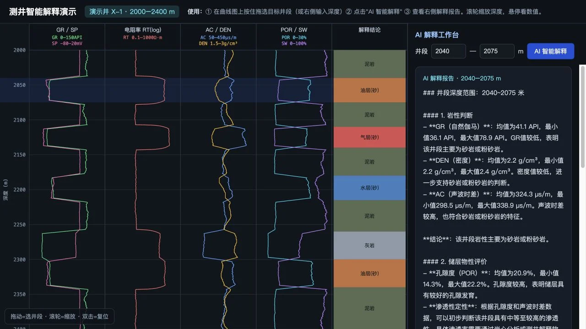
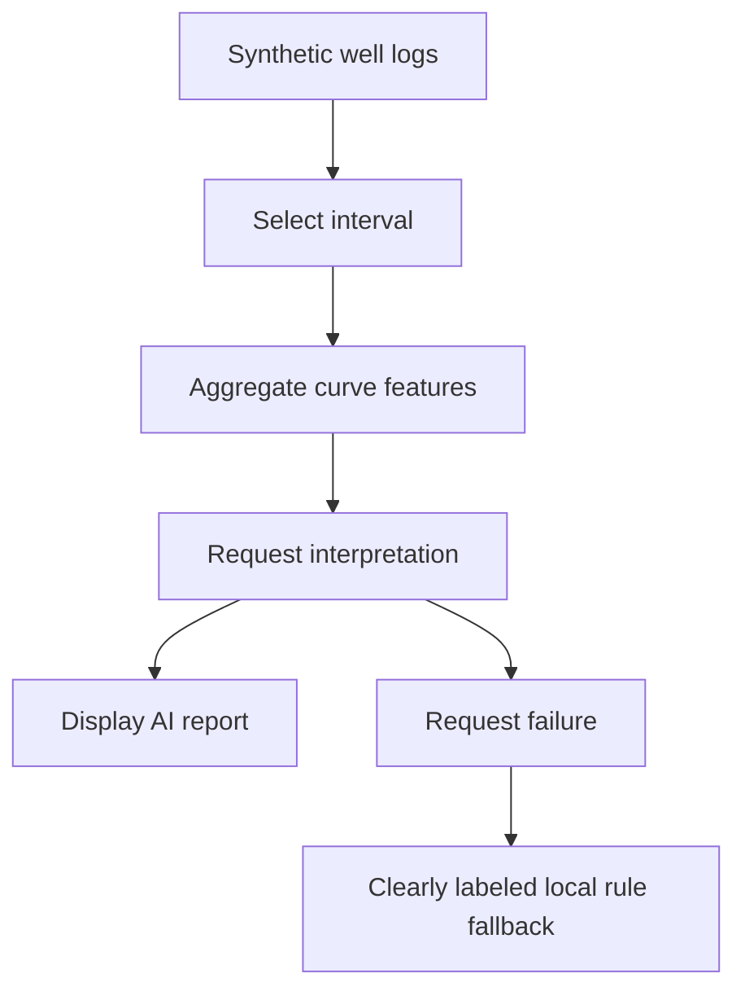

## Scenario and outcome

[Open the live well-log interpretation workspace](https://hao2-welllog-ai.vercel.app)

Well-log interpretation compares several measurements along a shared depth axis. He Ao’s industry showcase combines interval selection, numerical features, and an AI report so that an interpretation request stays tied to a specific section of the well.

*Screenshot from the showcase collection; original demonstration by He Ao. The application uses synthetic well data.*

### Try it in three minutes

1. Open demonstration well X-1 and inspect the GR, SP, RT, AC, DEN, POR, and SW curves.
2. Drag across the curves or enter upper and lower depths. Scroll to zoom and double-click to reset.
3. Select AI interpretation and compare the returned report with the chosen interval and feature values.

A request for **2040–2075 m** successfully returned an AI report during inspection, covering lithology, physical properties, fluid interpretation, and suggestions. This verifies the interaction from interval selection to report delivery, not the geological accuracy of the conclusions.

The demonstration covers 2000–2400 m at 0.5 m spacing. Public frontend code generates its curves with a fixed random seed, layer baselines, and noise. It is a reproducible synthetic example, not production oilfield data.

## Implementation approach

### Calculate features before asking for an explanation

The frontend selects samples within the requested interval and computes each curve’s mean, minimum, and maximum. It sends `depthRange` and `features` to the same-origin `/api/interpret` endpoint.

Deterministic code owns numerical aggregation; the model receives explicit features to interpret. The frontend confirms this request structure, but the public application does not expose a verifiable backend Agent configuration or QCA invocation trace. A multi-agent architecture cannot be inferred from the interface alone.

### Make failure visible

| Stage | Observed frontend behavior | User benefit |
|---|---|---|
| Validation | Requires ordered depths inside the demonstration range | Rejects invalid intervals |
| Pending | Shows loading and disables submission | Prevents duplicate clicks |
| Success | Displays returned interpretation text | Keeps the report in the workspace |
| Failure | Shows service unavailability and an explicitly labeled local rule fallback | Separates model output from rule-based output |

The successful path was exercised live. Fallback behavior was inspected in public frontend code; no service failure was deliberately induced. Labeling the source of the result prevents a template-based fallback from being mistaken for a completed model interpretation.

### Keep the evidence close

Curves remain alongside the report, allowing readers to revisit the selected interval. Summary statistics, however, compress variation: thin layers or intervals spanning multiple formations may need finer segmentation before interpretation.

## Reuse guidance

For other industrial analysis tasks, retain the sequence of selecting data, computing explicit features, and requesting an explanation. Associate each report with its interval, data version, and request identifier so that changing the selection does not make an older report look current.

For evaluation, have domain experts establish reference conclusions on synthetic or authorized data. Cover intervals spanning layers, missing curves, anomalous values, and endpoint failures. Assess numerical calculations, evidence use, and interpretation quality separately; producing a complete-looking report is not sufficient evidence of success.

Operational suggestions such as perforation or well testing require professional review. The reusable contribution is an industry workspace with explicit selection, visible evidence, and transparent failure handling.
