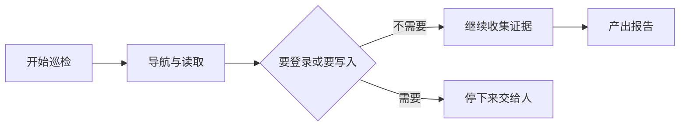
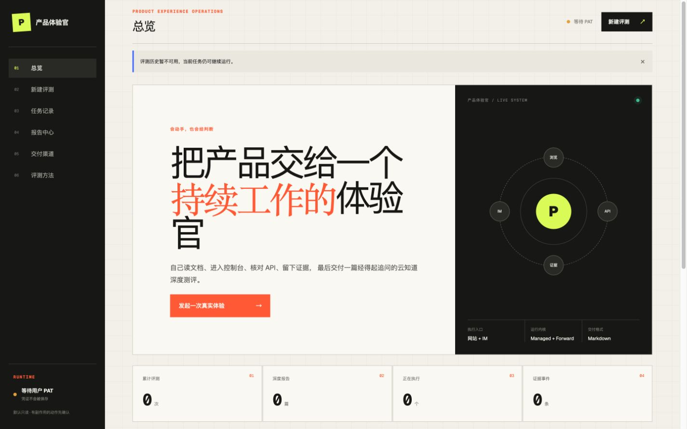

## 适用场景与边界

每次产品要发版，总得有人从新用户视角把东西重新点一遍：文档看得懂吗？控制台的按钮点下去有反应吗？API 的报错跟文档写的一样吗？这活儿枯燥、重复，而且做久了人会习惯性跳过——因为你太熟了，闭着眼都知道下一步点哪。

Agent 不会「太熟」。给它装上浏览器能力，它就会老老实实按你给的路径走一遍，然后把看到的东西写下来。

有意思的是，这种「不熟」反而是它最大的价值。我拿它去巡检自家产品，它照着官方文档说的 401 错误格式去核对真实响应，结果发现响应体的字段结构跟文档描述压根不是一回事——这种问题老手会下意识跳过，因为「我知道实际长什么样」。

不过这套玩法有几个前提，不满足就别硬上：

- **产品得有公开能进的入口。** 文档站、控制台、公开 API，至少得有能被看见的东西。全靠内网或者必须登录才能看到任何东西，Agent 无从下手。
- **默认只读。** 巡检的目的是发现问题，不是把被测系统改了。这条不只是「建议」——它决定了你敢不敢把这东西挂上定时任务自动跑。
- **每条结论都得能问出「你怎么知道的」。** 这是最容易翻车的地方，后面细说。

也说说什么时候别用它。如果目标产品必须登录、而你手上没有合法的测试账号，那就到此为止——不要给 Agent 一个真账号让它「想办法进去」。遇到登录页的正确反应是停下来喊人，而不是自己琢磨。

我实测时就撞上了这个：控制台整个命名空间在未登录时全被重定向到登录页。Agent 到这儿就停了，在报告里老实写「控制台未执行」。这个结果不好看，但它是真的——比编一段「控制台体验流畅」有价值得多。

下面这张图就是它的行为边界，简单到一句话能说完：能看的随便看，要动手或要登录就停。

### 效果预览

产品体验官演示首页：评测任务、报告中心与执行入口。来源：原 showcase 素材。

## 推荐做法

一句话总结：**能力给满，权限锁死，说话算话。**

能力给满是因为你想要它真的去点网页，而不是抓个 HTML 回来糊弄你。权限锁死是因为你不想半夜被告知它把测试环境的数据改了。说话算话是最容易被忽略的一条——报告里每句话都得对得上一次真实操作。

| 决策 | 推荐方式 | 原因 |
|---|---|---|
| 浏览器能力 | 显式启用浏览器工具集，并带上它要求的 Beta 头 | 少一个头就没有真实网页操作，也没有实时预览 |
| 写入类内置工具 | 直接配拒绝策略 | 只读巡检不需要它们，能关就关 |
| 你自己的令牌 | 只放在当前会话内存里，随请求发一次 | 不落库、不写日志、不进环境变量，关掉页面就没了 |
| 被测产品的账号密码 | 只写进平台的只写凭证接口，会话只拿到一个引用 | 明文永远不进 Prompt、日志、报告和数据库 |
| 碰到登录页 | 停下来，让人在浏览器预览里自己登 | 浏览器工具没有「安全输入密码」这种协议，别让 Agent 碰 |
| 多用户的历史记录 | 用一个随机凭据隔离，不从任何身份信息推导 | 清掉它旧记录就看不见了，简单有效 |

有几个点是我踩过才知道的：

**浏览器工具的版本号和它要求的 Beta 头是一套东西。** 升级一个忘了另一个，表现就是工具「看起来配了但没生效」，而且不一定报错——它只是安静地不干活。改的时候一起改，测的时候一起测。

**分清「我真点了」和「我只是看了文档」。** 这是整件事的信誉基础。Agent 完全有能力抓个网页然后把内容写得像亲自操作过一样。所以规则得写死：没真跑浏览器，报告里必须标明。我那轮巡检里 Agent 就自己区分得挺清楚——哪些是浏览器实操、哪些只是抓的文档，分开列的。

**报告要优先拿平台交付的原件。** 如果拿不到、退回去拼接 Agent 的消息，你会得到一些很滑稽的东西——比如报告第一行是模型的开场白「好了，以下是完整报告」。这不影响内容，但它说明产物交付那步没走通，值得查。

## 验证与维护

这套系统最讽刺的地方是：**它本身也需要被巡检。** 一个声称「我会给你证据」的东西，你凭什么信它给的证据是真的？

所以每轮跑完，至少确认三件事：

**浏览器是不是真的动了。** 翻证据记录，看有没有导航、点击、截图这类真实的浏览器调用。如果全是网页抓取，那报告里所有关于控制台的结论都得打问号——不管它写得多具体。

**只读到底守住了没有。** 一轮干净的只读巡检应该是「零写入、零临时凭证、无需清理」。任何一项对不上，说明契约漏了，先别管报告内容，先去查权限配置。

**报告是完整的吗。** 看它是从交付原件来的，还是拼消息拼出来的。后者往往意味着中间出过状况。

长期维护上，我最想提醒的是一个**不报错的坑**：如果证据统计只取最新一批事件、又不做分页，那么跑得越久，早期的工具调用就会被新事件挤出统计窗口。

我盯着数据库看过整个过程，工具调用数是一路往下掉的——不是它变懒了，是证据被挤没了。这种问题最阴险的地方在于它安安静静，不报错、不崩溃，你只会觉得「数字有点怪」。对一个把「证据齐全」当卖点的系统来说，这比直接挂掉严重得多。把它当成长期回归项盯着。

## 可选：Demo 源码

Demo 是个能直接跑的最小骨架：构造只读访问摘要、开一个会话、发一次巡检任务、轮询证据，最后自己检查只读契约有没有守住。核心那个访问契约模块是从真实项目里搬出来的，不是为演示重写的简化版。跑法和清理都在 README 里。

[查看 Demo 源码](https://github.com/QoderAI/cloud-agents-cookbook/tree/main/demos/product-experience-officer)
