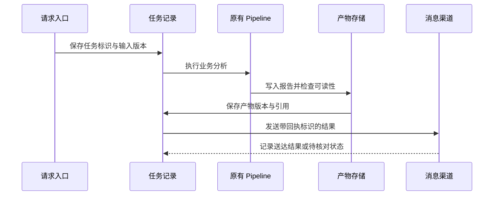

## 场景与成果

> **资料待补充。** 目前只有原 showcase 的方案摘要；缺少可公开的安装说明、实际恢复日志与任务截图。

一个在笔记本上运行良好的 Agent，上云后最容易出问题的往往不是推理逻辑，而是它原本默认存在的上下文：工作目录还在不在、这次请求属于谁、上一步是否已经完成、生成的文件发到哪里、进程重启后怎样继续。

蒲浦提供的“小别针”showcase 针对多 Pipeline、多 Skill 的本地 Agent，提出在核心业务逻辑外围补充身份识别、断点续跑、归档和 IM 交付。可复用的重点是这层适配边界，而非重写每个 Agent。现有可公开素材没有提供安装包、真实运行日志或恢复成功率，下文只将原资料中的适配职责与复用建议分开说明。

## 实现思路

### 先定义四个适配接口

以下是应用侧的参考分工。业务 Pipeline 仍负责产生报告，适配层负责回答“这是哪次任务、能否继续、产物是否完整、是否已经交付”。

| 接口 | 接收什么 | 交出什么 | 最容易遗漏的边界 |
|---|---|---|---|
| 任务入口 | 用户请求、来源会话、输入引用 | 稳定任务标识和输入版本 | 相同文本不一定是同一次请求 |
| 恢复入口 | 任务标识、检查点、产物记录 | 继续执行的位置 | 文件存在不代表属于当前输入 |
| 产物归档 | 本地输出、生成版本 | 可读取的持久化引用 | 不能把临时路径发给用户 |
| 消息交付 | 来源会话、产物引用、回执标识 | 已发送或待重试状态 | 消息超时可能已经实际送达 |

在接入已有 Agent 时，先让这些接口围绕原来的调用入口工作。不要一开始修改所有 Skill；否则无法判断失败来自原业务逻辑，还是新增的运行环境。

### 一次报告任务的完整时序

图中的归档和通知是两个独立步骤。通知失败返回通知阶段，而不是回到分析阶段。

检查点应该在对应证据持久化之后推进。若先标记“报告完成”，再写报告，崩溃时就会留下一个没有产物的完成状态。反过来，报告已写入但检查点未更新时，恢复逻辑应通过输入版本和完整性检查识别已有产物。

### 按故障位置决定下一步

| 中断位置 | 恢复时先检查 | 可以继续的动作 |
|---|---|---|
| 分析尚未完成 | 是否有可恢复的业务检查点 | 继续该阶段，或明确重算成本 |
| 报告写入过程中 | 文件完整性和所属版本 | 不完整则重建，不向外发送 |
| 已归档但未通知 | 产物可读性、来源会话 | 发送已有产物的回执 |
| 通知请求超时 | 渠道回执或幂等键 | 核对后补发，避免盲目重算 |
| 两个 Worker 同时恢复 | 任务所有权及版本 | 只有持有有效执行权的一方提交 |

这里最关键的工程选择是让“谁能提交结果”有明确依据。租约、条件更新或其他并发控制可以承担这个职责；单靠一个进程内的布尔变量无法跨进程保护任务。

## 复用建议

### 用一次可控制的中断验收适配层

先用测试输入生成一份短报告，在归档后、通知前中断进程。重新启动后，核对原任务标识没有变化、分析没有重复执行、报告版本一致、结果返回原会话。然后更换输入版本再次运行，确认旧报告不会被误用。

接入时先选择一条 Pipeline，记录首次运行和故障恢复分别耗时多久、重算了哪些步骤、是否产生重复通知。等这些事实可观察，再扩到多个 Skill。核心业务保持不变应通过前后输出对比证明，而不是仅凭“零代码接入”的描述判断。
