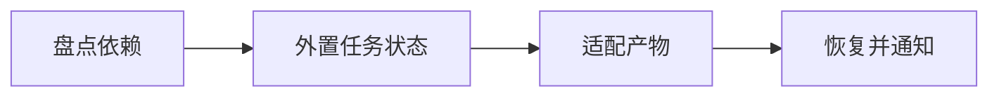

## 场景与成果

本地脚本成功运行一次，并不意味着它能在云端中断后恢复。小别针关注身份、持久状态、产物和消息交付这些外围能力，让已有 Agent 可以迁移到持续运行的环境。

为复杂本地 Agent 补充云端身份、断点续跑、产物归档和消息交付能力，减少迁移中的重复适配。

本文根据蒲浦提供的 showcase 资料整理。流程图与分工表用于解释案例中的方法；后面的具体示例是复用建议，不作为生产运行的实测结论。

## 实现思路

### 一次任务如何流经产品

原案例强调通过外围适配保留既有 Pipeline 与 Skill。业务逻辑与运行环境职责分开，持久状态帮助任务跨进程恢复。



每个环节都需要把自己的输入与结果交给下一步。后续步骤据此继续工作，用户也能沿着这条链查看结果从哪里产生、在哪一步需要确认。

### 角色分工与权威事实

| 组成部分 | 在案例中的职责 |
|---|---|
| 原 Agent | 保留业务执行逻辑 |
| 适配层 | 身份、检查点与恢复 |
| 交付层 | 产物归档与结果通知 |

上云适配不能仅复制脚本。恢复边界、持久化和产物生命周期需要显式定义；不具备幂等性的步骤应记录执行事实或留给人工处理。

### 沿着一个具体任务展开

把一个本地读取文件并生成报告的测试 Agent 迁移到云端，在进程中断后继续任务，最终只交付一份正确报告。

1. **盘点依赖**：列出本地路径、环境变量、工具版本和隐式状态，区分配置与任务数据。
2. **外置任务状态**：为任务定义身份、输入摘要、当前阶段和检查点，不依赖进程内变量恢复。
3. **适配产物**：将结果归档为可寻址文件，保存生成版本和完成状态，避免通知引用临时路径。
4. **恢复并通知**：重启时核对已完成步骤，只补执行缺失工作；通知失败单独重试。

这条流程的交付物需要保留过程中使用的依据。某一步缺少数据或执行失败时，应让状态继续可见，避免后续环节把它当作已经完成的结果。

### 让结果可以被核对

下面用一组合成数据说明预期交付。它是应用侧的说明样例，不是 QCA API 请求，也不是生产记录。

```json
{
  "input": {
    "checkpoint": "report-written",
    "artifact_exists": true,
    "notification": "failed"
  },
  "expected": {
    "next_action": "retry-notification",
    "recompute_report": false
  }
}
```

恢复逻辑首先检查已发生的事实。若归档文件损坏，则应该进入产物恢复，而不是把通知重试当作全部恢复。

## 复用建议

落地时可以先复现上面的一个任务，用已知输入核对交付结果，再补齐下面这些失败或歧义场景。通过后再扩大任务范围。

| 失败或歧义场景 | 需要保留的行为 |
|---|---|
| 计算后归档前中断 | 恢复后检查产物存在性与完整性。 |
| 同一任务被两个 Worker 领取 | 使用租约或等效机制防止并发写入。 |
| 通知失败 | 不重新执行已成功的计算。 |