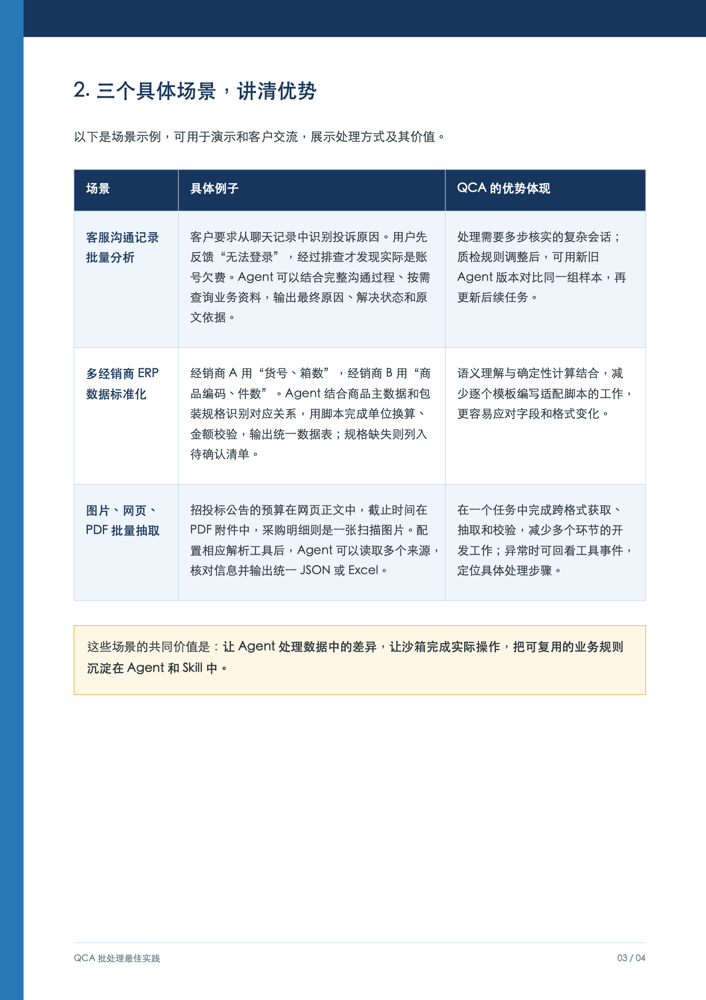
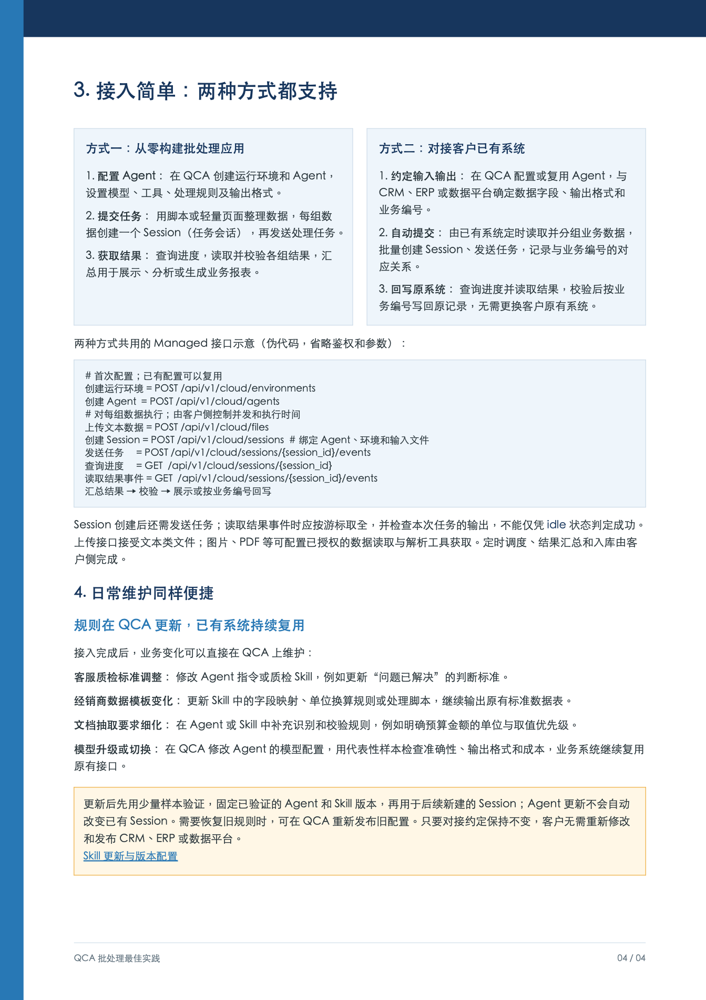
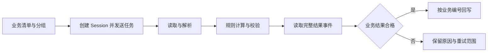

## 场景与成果

批量处理客服记录、经销商表格或招投标材料时，困难往往是输入不整齐：同一个问题散落在多轮对话里，同一种商品用了不同字段名，一份公告的信息又分布在网页、附件和扫描图中。固定模板能解决稳定输入，却容易在格式改变时失效。

本案例依据原 showcase 的《QCA 批处理最佳实践》（2026-09-07，4 页）重写。原资料将工作拆成 Agent 理解差异、沙箱执行操作、Skill 固化业务规则，以及业务系统调度和回写。它给出了接入方式与示例场景，没有提供可复现的生产吞吐或准确率测量。

### 三种输入，对应三种处理难点

| 业务任务 | 不能只做表面抽取的原因 | 需要交付的结果 |
|---|---|---|
| 客服沟通分析 | 用户最初说无法登录，后续排查才确认欠费 | 最终原因、解决状态、对话证据 |
| 经销商数据标准化 | “箱数”与“件数”必须结合包装规格换算 | 统一字段、标准数量、校验与待确认清单 |
| 多格式公告抽取 | 预算、截止日期、明细分别位于不同载体 | 带来源的统一记录与缺失项 |

这些任务适合按业务单元分组后异步处理。若输入结构长期稳定、计算规则固定且要求极低延迟，普通数据处理程序可能更合适；不必把所有批量计算都交给 Agent。

### 原始实践文档

原始文档第 3 页：三类业务场景。

原始文档第 4 页：两种接入方式与版本维护。

[查看原始四页 PDF](https://github.com/hellomypastor/cloud-agents-cookbook/blob/codex/cookbook-pages/site/media/qca-batch-processing-best-practices.pdf)

以上是原文件页面的直接渲染，不是运行界面截图。原文也明确将其中业务场景标为说明示例。

## 实现思路

### 托管运行与业务编排各负责什么

Managed Session 承担模型和已启用工具之间的多轮执行，沙箱处理文件与脚本。原资料同时明确：自定义业务工具、定时调度、结果汇总和入库仍由接入方完成。这决定了不能只接一个“提交任务”按钮就认为批处理系统已经完成。

应用侧至少保存业务编号、输入版本、Session 对应关系和回写状态。Session 是执行载体，业务编号才是回写原记录的依据；两者不应混为一个字段。

### 完整链路：提交之后还有结果判定

下面展示业务系统与托管执行之间的交接。每一组数据都需要独立完成校验，才能进入回写。

创建 Session 后还需要发送任务。读取事件时要取全本次任务的结果，不能把 idle 当作成功：会话可能等待输入，也可能没有生成符合约定的业务产物。业务判定应检查必需字段、输出所属输入版本、行数和异常清单。

### 回写为什么需要独立状态

业务系统读取到合格结果后，回写请求也可能超时。此时 Session 已经完成，不应该重新执行解析。可以用“业务编号加输入版本”作为应用侧幂等依据，让重试继续提交同一结果。

| 状态 | 代表什么 | 下一步 |
|---|---|---|
| 待提交 | 有输入，但还没有执行记录 | 创建并记录执行关系 |
| 处理中 | 已发送任务，业务结果尚未确认 | 继续读取进度与结果 |
| 待确认 | 缺规格或业务口径 | 补充材料后重新处理受影响项 |
| 待回写 | 结果合格，入库未确认 | 核对或重试入库 |
| 已完成 | 结果及回写均确认 | 保留版本和追溯记录 |

这张状态表是参考应用设计，不是 QCA 的状态枚举。它的作用是防止把模型执行、业务验收和系统回写压成一个“成功”字段。

### 版本升级应比较同一批样本

原资料指出，更新 Agent 不会自动改变已经存在的 Session。升级时应固定代表性输入，用旧版和新版分别新建任务，比较字段准确性、异常识别、输出格式和实际成本，再让后续批次使用通过验证的版本。

样本至少包含正常订单、缺失规格、冲突字段与多格式输入。只用最容易成功的一条记录测试，无法判断新版是否改善了真正的复杂场景。

## 复用建议

从一个经销商的一小批数据开始，先跑通“输入编号—执行记录—结果校验—回写记录”。再增加第二种模板，观察哪些差异应写入 Skill，哪些应该通过主数据补齐。对于 PDF 和图片，原资料要求另行配置授权的读取及解析工具，不能默认文本上传接口承担所有格式处理。

成本比较应使用同一输入与同一验收标准，统计模型、工具运行、失败重试和人工复核。原资料提及夜间商务优惠，但具体政策和同任务实测才决定总成本，不在本案例给出未经核实的折扣或节省比例。
