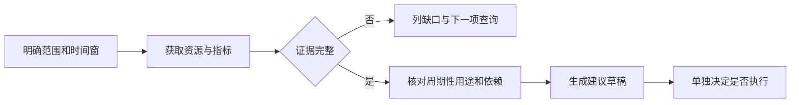

## 场景与成果

云资源查询往往只是任务的第一步。发现一个高成本实例之后，还要核对利用率、业务时段和上下游依赖，才能判断下一步是否值得执行。Cloud Use 的应用方向，是让云端 Agent 在获得授权的工具边界内连续完成这些工作。

[官方接入文档](https://docs.qoder.com/zh/cloud-agents/best-practices/cloud-use)介绍了通过 OpenAPI MCP、OAuth 凭证和 Skill 接入云操作的方式。本篇以“生成一份可复核的资源检查报告”为参考实践，具体报告结构和验收步骤是应用设计，不是官方示例的运行结果。

## 实现思路

### 接入前，先确定报告能回答的问题

“帮我省钱”不是一个足够明确的任务。它没有时间范围，也没有允许查看的资源范围。一个可执行的起点是：检查测试项目在指定时间窗内的资源利用情况，列出证据完整和证据不足的对象，形成建议草稿。

这能将三个问题拆开：工具能否取得数据、数据是否足以支持判断、建议是否适合执行。第一个问题成功，不意味着后两个也成功。

### 建立连接，再验证最小只读任务

按官方文档完成账号侧应用授权、在 Cloud Agents 中配置 MCP OAuth 凭证，并将对应工具和凭证关联到 Agent 与会话。账号所属站点和具体控制台入口以官方指南为准。接入后先验证一个明确范围的只读请求，确认返回对象和预期账号一致，再扩展任务。

不要把凭证写进任务提示词或报告。应用应向任务提供范围和目标，而不是让报告携带认证材料。

### 从证据到建议的处理顺序

以下是参考报告流程。缺少证据走补查分支，而不是被当作低利用率。

### 查询失败时，先分清失败发生在哪一层

工具没有返回结果时，报告不要统一写成“资源为空”。身份没有授权、查询范围错误、指标时间窗没有数据、解析输出失败，会导致完全不同的下一步。

| 观察 | 核查方向 | 不应得出的结论 |
|---|---|---|
| 工具返回授权错误 | 凭证状态与工具权限 | 账号中没有资源 |
| 资源查询成功、指标为空 | 指标窗口和采集条件 | 利用率等于零 |
| 指标存在、业务用途未知 | 周期任务与依赖关系 | 可以直接停止 |
| 建议生成、动作未执行 | 执行记录与结果查询 | 已经完成优化 |

报告中保留失败层次，可以让第二次请求只补缺失信息，不必重跑整轮任务。

## 复用建议

### 用两轮请求走通检查与补查

第一轮可以这样提问：

> 检查测试范围内的资源使用情况。明确时间窗，为每个对象列出已有指标、证据缺口和下一项核查，不执行资源变更。

第二轮选择一个候选项，补充它的周期性用途，要求重新评估。合格结果应能改变或撤回原建议，而不是因为已经生成了报告就坚持第一次结论。

应用接入完成的依据是：身份和范围正确、查询结果可追溯、缺失数据被正确表达、后续动作有独立结果。若要加入调度或事件触发，先让同一个手动任务稳定通过这些检查，再增加触发方式。
