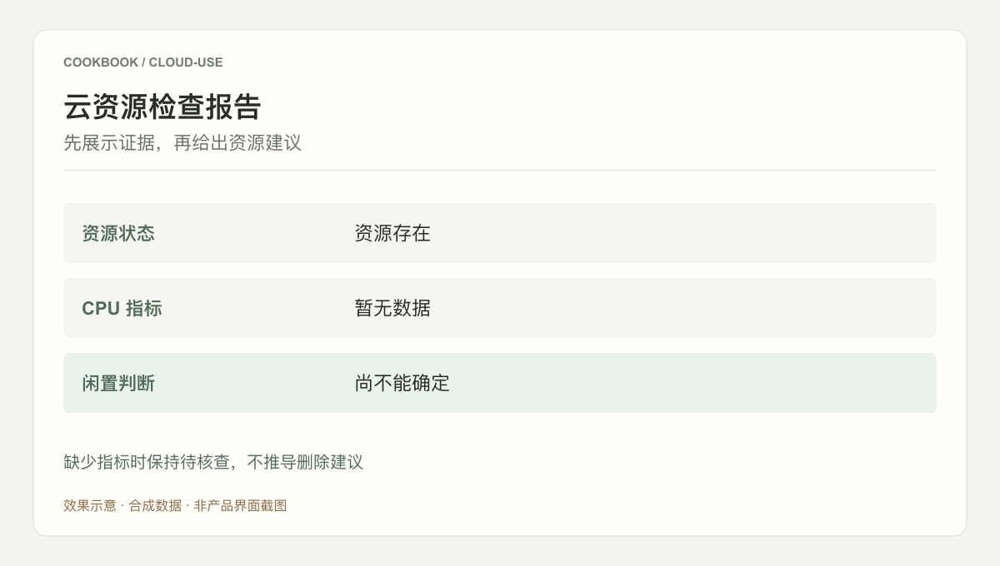

## 场景与成果

云资源操作需要把用户意图映射到明确的资源与工具调用。Cloud Use 将身份、权限和调用结果纳入流程，使查询与后续操作都有可以核对的依据。

[阅读公开文档](https://docs.qoder.com/zh/cloud-agents/best-practices/cloud-use)

将云资源查询、分析与运维能力通过工具接口交给 Agent，并围绕机器身份与权限边界组织执行。

本文根据QCA Cloud Use 团队提供的 showcase 资料整理。流程图与分工表用于解释案例中的方法；后面的具体示例是复用建议，不作为生产运行的实测结论。

### 效果预览



根据本文案例绘制的结果示意，使用合成数据，非产品截图。缺少指标时保持待核查，不推导删除建议

## 实现思路

### 一次任务如何流经产品

案例强调使用受治理的身份连接 OpenAPI MCP 与 Skill。资源状态来自工具调用，Agent 负责理解目标、选择工具与整理执行结果。


每个环节都需要把自己的输入与结果交给下一步。后续步骤据此继续工作，用户也能沿着这条链查看结果从哪里产生、在哪一步需要确认。

### 角色分工与权威事实

| 组成部分 | 在案例中的职责 |
|---|---|
| 身份与权限 | 限定资源与允许动作 |
| Agent | 理解目标并组织调用 |
| 云工具 | 查询事实与执行结果 |

云操作场景需要把观察、建议与变更分为不同阶段。模型可以组织信息，但资源身份、权限与工具返回值才是执行边界。

### 沿着一个具体任务展开

只读盘点一个测试资源组的闲置资源，返回资源清单与判断依据，不自动删除或修改资源。

1. **限定身份范围**：为工具调用配置最小资源范围，明确此次只有查询权限。
2. **收集资源事实**：查询资源状态和相关指标，保留时间窗口，不能只凭名字判断闲置。
3. **生成候选建议**：将使用率、关联依赖和缺失指标共同呈现，给出待确认清单。
4. **人工核对**：用户核对后再决定是否发起新的变更任务；查询报告不隐含操作授权。

这条流程的交付物需要保留过程中使用的依据。某一步缺少数据或执行失败时，应让状态继续可见，避免后续环节把它当作已经完成的结果。

### 让结果可以被核对

下面用一组合成数据说明预期交付。它是应用侧的说明样例，不是 QCA API 请求，也不是生产记录。

```json
{
  "input": {
    "cpu_metric": null,
    "resource_exists": true
  },
  "expected": {
    "idle": "undetermined",
    "delete_recommended": false
  }
}
```

缺失指标不能按零处理。闲置判断还需要资源依赖与业务用途，示例只验证数据不足时不会给出越界建议。

## 复用建议

落地时可以先复现上面的一个任务，用已知输入核对交付结果，再补齐下面这些失败或歧义场景。通过后再扩大任务范围。

| 失败或歧义场景 | 需要保留的行为 |
|---|---|
| 指标缺失 | 标记无法判断，不将其当作零使用率。 |
| 资源仍有依赖 | 在建议中说明依赖阻塞。 |
| 工具权限不足 | 报告失败范围，不扩大权限重试。 |